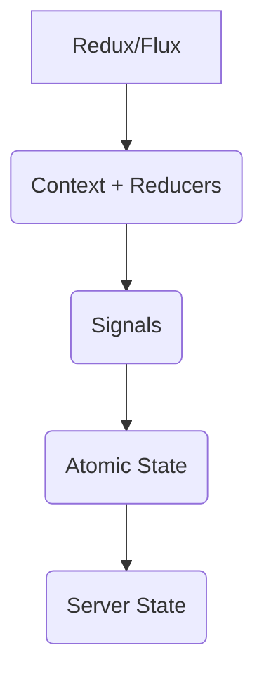
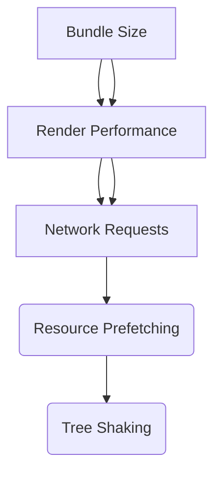
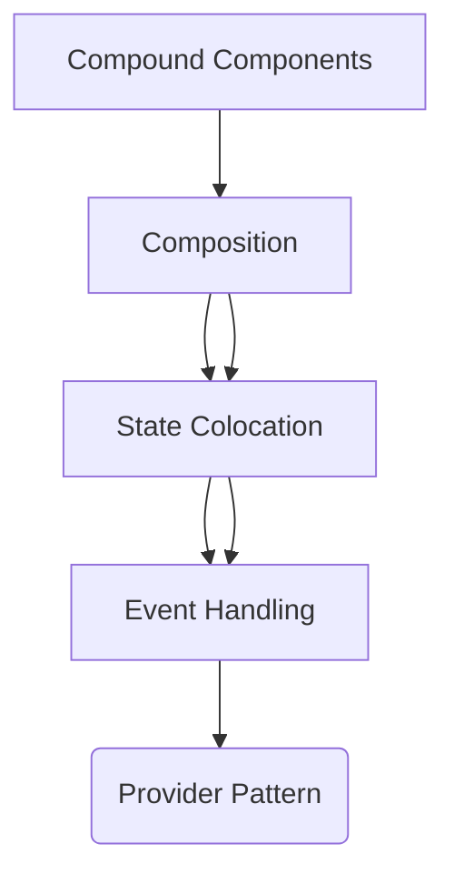
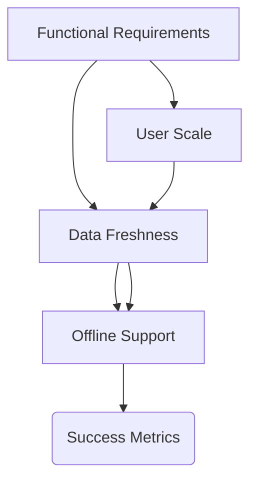
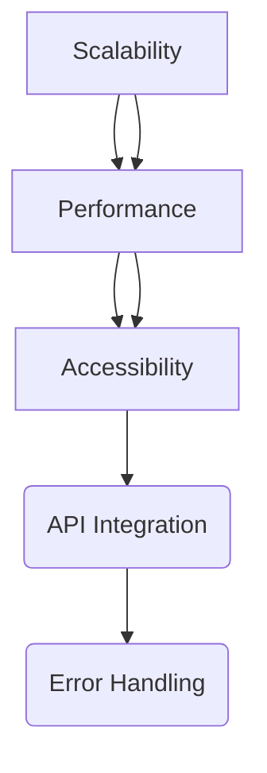
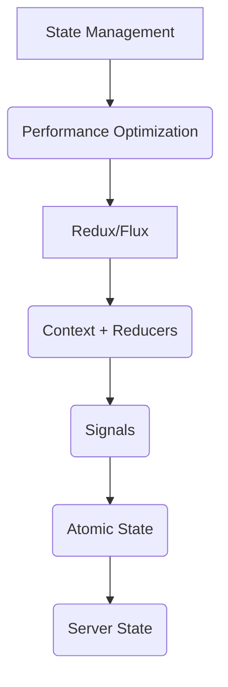

# Frontend System Design Reference

## 🎯 Case Studies Database

| [[E-commerce Product Page]]                                       |
| ----------------------------------------------------------------- |
| [[System Design/case-studies/Chat Application\|Chat Application]] |
| [[Design System Builder]]                                         |
| [[File Management System]]                                        |

### Analytics Dashboard
- [ ] **Difficulty:** Medium  
- [ ] **Focus:** Data Visualization  
- [ ] **Status:** Pending  
- [ ] **Category:** Frontend  

#### Implementation Details:  
- Chart Rendering  
- Data Processing  
- Filter System  
- Export Functionality  
- Real-time Updates  

#### Optimization Areas:  
- Memory Management  
- Render Performance  
- Data Caching  
- Lazy Loading  


## 🔍 Implementation Patterns

### State Management Patterns


#### Considerations:
- State Shape  
- Update Frequency  
- Data Dependencies  
- Performance Impact  

### Performance Optimization


### Component Architecture


## 📊 Interview Strategy

### System Requirements Analysis


#### Key Areas:
- Functional Requirements  
- Non-functional Requirements  
- Scale Considerations  
- Edge Cases  
- Success Metrics  

#### Questions:
- User Scale  
- Traffic Patterns  
- Data Freshness  
- Offline Support  

### Architecture Planning


#### Focus Points:
- Component Structure  
- Data Flow  
- State Management  
- API Integration  
- Error Handling  

#### Considerations:
- Scalability  
- Maintainability  
- Performance  
- [[Accessibility]]  

### Implementation Deep Dive


## 🔗 Related Notes  
- [[Frontend Architecture]]  
- [[Performance Optimization]]  
- [[Component Design Patterns]]  
- [[State Management Solutions]]  

---

## 🗂️ Progress Tracking
```dataview
TASK FROM "_index.md.md"
WHERE !completed
GROUP BY file.link
```


## 🗂️ Review Checklist
```markdown
- [ ] **Implementation:** 
  - [ ] State Management 
  - [ ] Performance Optimization  
  - [ ] Component Architecture  

- [ ] **Testing:**
  - [ ] Unit Tests  
  - [ ] Integration Tests  
  - [ ] Load Testing  

- [ ] **Deployment:**
  - [ ] Scaling Strategy  
  - [ ] Rollback Plan  
  - [ ] Monitoring  

- [ ] **Optimization:**
  - [ ] Cache Efficiency  
  - [ ] Resource Utilization  
  - [ ] Error Handling  

```

**Tradeoffs:**  
- [ ] Decide between WebSocket and MQTT for real-time messaging  

**Optimizations:**  
- [ ] Implementing data sampling for performance monitoring  
- [ ] Using Web Workers for resource-intensive tasks  

---

**Obsidian Integration Tips:**
1. Create `System Design/Case Studies/` folder  
2. Use templates for new case studies  
3. Link to [[Frontend Roadmap]] and [[JavaScript Roadmap]]  
4. Enable backlinks for connected concepts  

> "Good design is obvious. Great design is transparent." - Joe Sparano  
> ```query
> path:"System Design"
> ```

Key Features:
1. **Interactive Progress Tracking**: Dynamic completion percentage  
2. **Visual Architecture**: Mermaid diagrams for system flows  
3. **Case Study Library**: Real-world examples with requirements  
4. **Interview Alignment**: Common system design questions  
5. **Knowledge Network**: Dataview-powered connections  

Implementation Steps:
6. Create `System Design/` folder  
7. Add subfolders:  
   - `Case Studies/`  
   - `Templates/`  
   - `Resources/`  
8. Enable these plugins:  
   - Dataview  
   - Templater  
   - Mermaid  
9. Use daily notes for design journaling:  
```markdown
## {{date:YYYY-MM-DD}} Design Journal
**Today's Focus:**  
- [ ] 

**Key Decisions:**  
- [ ] 

**Tradeoffs Considered:**  
- [ ] 
```