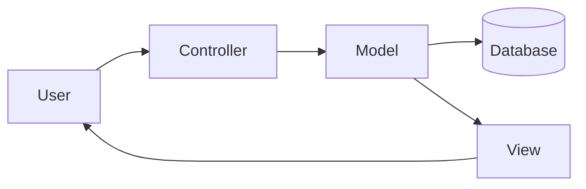

# MVC Architecture

## Overview

- **Model**: Manages data & business logic & interacts with databases
- **View**: Handles data presentation (UI)
- **Controller**: Processes user input & coordinates Model/View

**Frameworks**: Express, Koa, Django, NestJS