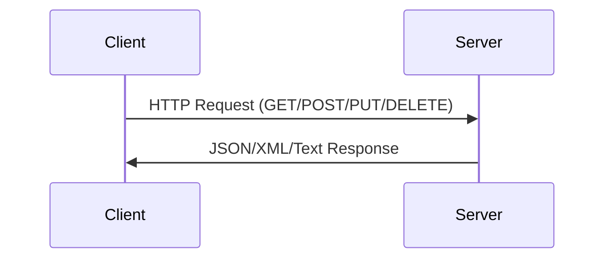

# REST API Architecture

## Overview

- **Constraints**:
  1. Client-server independence
  2. Stateless communication
  3. Resource-based operations
  4. Uniform interface

**Data Formats**: JSON (most common), HTML, XML, Plain Text