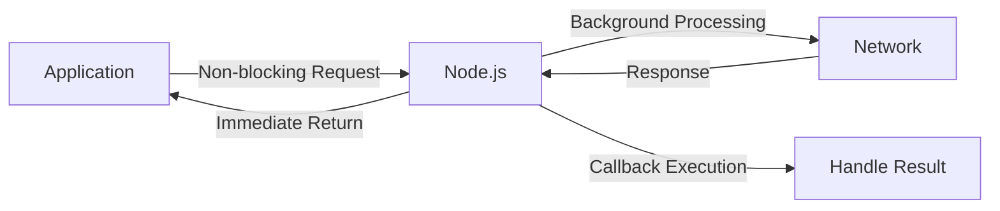
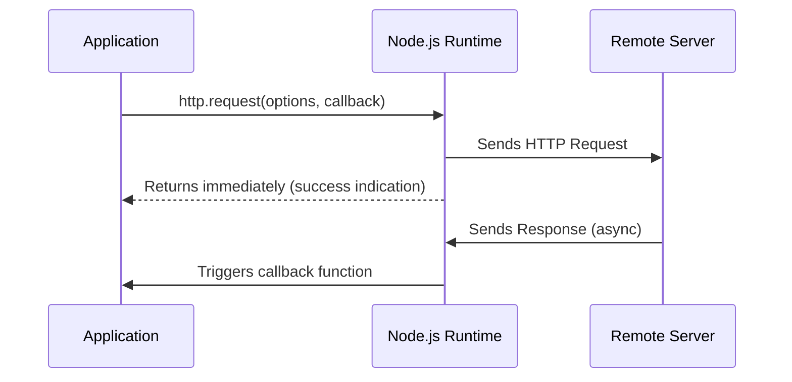
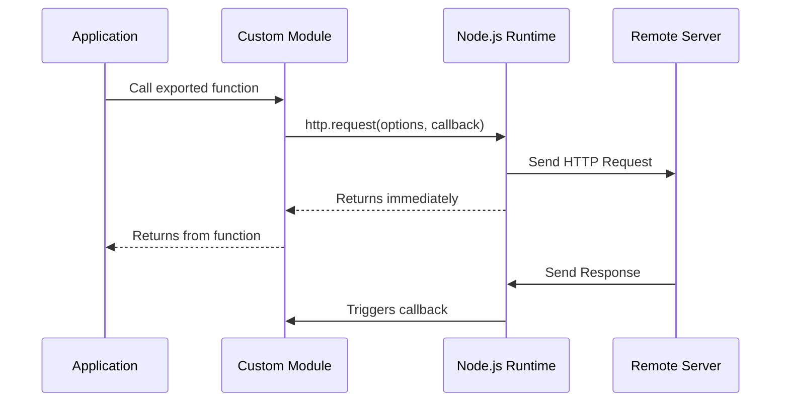

## Core Concepts
### The Challenge: Blocking I/O

- Network operations (web services, APIs) don't return immediately
- Traditional blocking approach:
  - Application waits for response
  - Server CPU sits idle → wasted processing time
- Result: Reduced throughput and scalability

### Node.js Solution: Non-blocking I/O

- Network operations return immediately
- CPU continues processing other tasks
- **[[Callback Functions]]** handle results when ready
- Result: High efficiency and scalability

---
description: React notes and reference about Asynchronous IO with Callback Programming.

## HTTP Request Flow
### Basic Sequence


### With Custom Module


---

## Practical Implementation
### HTTP Request Example
```javascript
const http = require('http');

// Configuration
const options = {
  host: 'w1.weather.gov',
  path: '/xml/current_obs/KSFO.xml' // SFO weather data
};

// Make non-blocking request
const req = http.request(options, (response) => {
  let buffer = '';
  
  // Handle data chunks
  response.on('data', (chunk) => {
    buffer += chunk;
  });
  
  // Handle response completion
  response.on('end', () => {
    console.log('Weather data:', buffer);
    // Process XML data here
  });
});

// Finalize request
req.end();
```

### Key Components:
1. **Options Object**:
   - `host`: Target server (w1.weather.gov)
   - `path`: Resource endpoint
   - (Optional: method, port, headers)
2. **Callback Function**:
   - Receives `response` object
   - Handles asynchronous events
3. **Event Handlers**:
   - `data`: Accumulates response chunks
   - `end`: Processes complete response

---

## Error Handling
### Critical Implementation
```javascript
const req = http.request(options, (res) => {
  // ... response handling ...
});

// Network error handling
req.on('error', (err) => {
  console.error('Request failed:', err.message);
  
  if (err.code === 'ECONNREFUSED') {
    console.error('Server unavailable');
  }
});

// Timeout handling
req.setTimeout(5000, () => {
  req.destroy();
  console.error('Request timed out');
});
```

### Common Error Types:
| **Error Code**     | **Meaning**                  | **Solution**                     |
|--------------------|------------------------------|----------------------------------|
| `ECONNREFUSED`     | Server not accepting connections | Verify server status/port        |
| `ETIMEDOUT`        | Connection timeout           | Increase timeout or check network |
| `ENOTFOUND`        | DNS resolution failed        | Check hostname spelling          |
| `ECONNRESET`       | Remote connection reset      | Implement retry logic            |

---

## Best Practices
1. **Always Handle Errors**: Uncaught errors crash Node.js processes
2. **Use HTTPS for Security**:
   ```javascript
   const https = require('https');
   https.request(...); // Same interface as http
   ```
3. **Set Timeouts**: Prevent hanging requests
4. **Stream Large Responses**: Use piping instead of buffering
5. **Reuse Connections**: Enable `keep-alive` for performance
   ```javascript
   options.agent = new http.Agent({ keepAlive: true });
   ```

---

## Why This Matters: Real-World Impact
| **Approach**       | **Requests/Sec** | **CPU Utilization** | **Scalability** |
|--------------------|------------------|---------------------|-----------------|
| Blocking I/O       | 120              | 15%                 | Poor            |
| Non-blocking I/O   | 2,300+           | 98%                 | Excellent       |
*Source: Node.js Foundation Benchmark (v18.x)*

> "Node.js can handle tens of thousands of concurrent connections by using non-blocking I/O and the event loop, where traditional blocking servers would require thread pools that consume significant memory." - Node.js Documentation

---

## Recap: Key Takeaways
1. **Non-blocking I/O**: Node.js returns control immediately
2. **Callback Pattern**: Handle results when ready
3. **Event-Driven Architecture**: 
   - `data` for partial responses
   - `end` for complete responses
   - `error` for fault handling
4. **Always Implement**:
   - Error handlers
   - Timeout protection
   - Secure connections (HTTPS)
