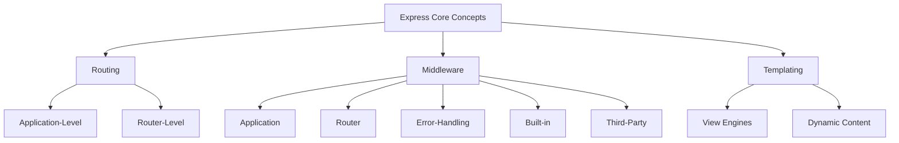
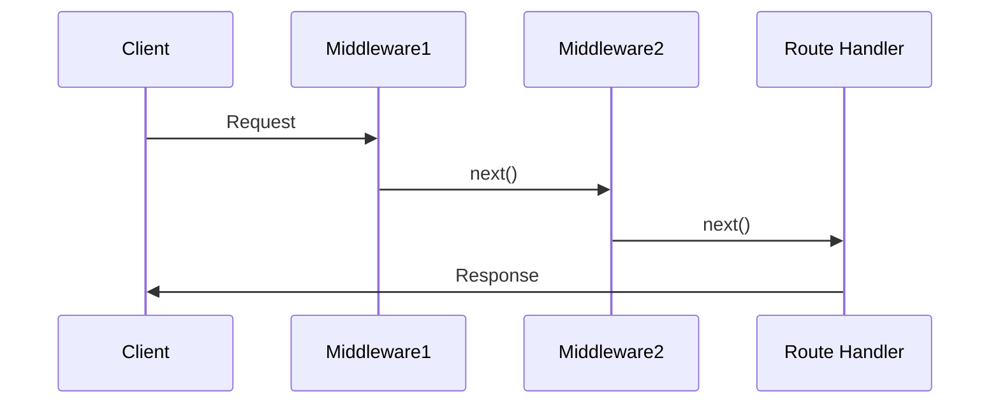

## Routing in Express
### 1. Application-Level Routing
```javascript
// Basic route handling
app.get('/user/:id', (req, res) => {
  res.send(`User ID: ${req.params.id}`);
});

app.post('/user/:id', (req, res) => {
  // Handle POST request
});

// Handling multiple methods
app.route('/item/:id')
  .get((req, res) => { /* GET handler */ })
  .post((req, res) => { /* POST handler */ });
```

### 2. Router-Level Routing (Modular)
```javascript
// users.js router
const express = require('express');
const router = express.Router();

router.get('/:id', (req, res) => {
  res.send(`User ${req.params.id} details`);
});

router.get('/:id/profile', (req, res) => {
  res.send(`Profile for user ${req.params.id}`);
});

module.exports = router;

// Main app.js
const userRouter = require('./routes/users');
app.use('/user', userRouter); // Handles /user/:id and /user/:id/profile
```

### Routing Comparison
| **Feature**         | **Application-Level**       | **Router-Level**          |
|---------------------|-----------------------------|---------------------------|
| **Best For**        | Small apps, few routes      | Large apps, many routes   |
| **Organization**    | All routes in one file      | Modular separation        |
| **Middleware**      | Global application          | Route-specific            |
| **Reusability**     | Limited                    | High across projects      |

## Middleware System
### Middleware Flow


### Middleware Types
1. **Application-Level Middleware**  
   ```javascript
   // Global middleware (runs on every request)
   app.use((req, res, next) => {
     console.log(`Request to ${req.path}`);
     next(); // Pass control to next middleware
   });

   // Authentication middleware
   app.use((req, res, next) => {
     if (req.query.password === 'pwd123') {
       next();
     } else {
       res.status(402).send('Login failed');
     }
   });
   ```

2. **Router-Level Middleware**  
   ```javascript
   // Specific to router instance
   const adminRouter = express.Router();
   adminRouter.use((req, res, next) => {
     if (req.user.isAdmin) next();
     else res.status(403).send('Forbidden');
   });
   ```

3. **Error-Handling Middleware**  
   ```javascript
   // Must have 4 parameters (err, req, res, next)
   app.use((err, req, res, next) => {
     console.error(err.stack);
     res.status(500).send('Server error!');
   });

   // Route with error
   app.get('/user/:id', (req, res) => {
     if (req.params.id === '1') {
       throw new Error('Admin access error');
     }
     res.send(`Hello user ${req.params.id}`);
   });
   ```

4. **Built-in Middleware**  
   ```javascript
   // Static file serving
   app.use(express.static('public'));
   
   // JSON parsing
   app.use(express.json());
   
   // Form data parsing
   app.use(express.urlencoded({ extended: true }));
   ```

5. **Third-Party Middleware**  
   ```bash
   npm install morgan helmet cors
   ```
   ```javascript
   const morgan = require('morgan');
   const helmet = require('helmet');
   const cors = require('cors');
   
   app.use(morgan('dev'));  // Logging
   app.use(helmet());       // Security headers
   app.use(cors());         // Cross-Origin Resource Sharing
   ```

### Custom Middleware
```javascript
// Request time logger
const requestLogger = (req, res, next) => {
  console.log(`[${new Date().toISOString()}] ${req.method} ${req.path}`);
  next();
};

app.use(requestLogger);
```

## Templating in Express
### Setup and Rendering
```javascript
// Set view engine (EJS example)
app.set('view engine', 'ejs');
app.set('views', path.join(__dirname, 'views'));

// Render template with data
app.get('/profile/:id', (req, res) => {
  const user = {
    id: req.params.id,
    name: 'Alice',
    joinDate: '2023-01-15'
  };
  res.render('profile', { user });
});
```

### View Engine Comparison
| **Engine**   | **Syntax**       | **Features**                  |
|--------------|------------------|-------------------------------|
| **EJS**      | HTML + JS        | Simple, familiar syntax       |
| **Pug**      | Indentation-based| Clean, minimal code           |
| **Handlebars**| {{variables}}   | Logic-less, safe templating   |
| **React**    | JSX              | SSR with React components     |

### Example: React SSR
```javascript
// Install view engine
npm install express-react-views react react-dom

// Configure
app.set('views', __dirname + '/views');
app.set('view engine', 'jsx');
app.engine('jsx', require('express-react-views').createEngine());

// views/profile.jsx
function Profile({ user }) {
  return (
    <div>
      <h1>{user.name}</h1>
      <p>Member since: {user.joinDate}</p>
    </div>
  );
}
```

## Best Practices
1. **Middleware Order Matters**:
   ```javascript
   // Correct order:
   app.use(helmet());
   app.use(cors());
   app.use(express.json());
   app.use(requestLogger);
   app.use('/api', apiRouter);
   app.use(errorHandler);
   ```

2. **Route Organization**:
   ```
   project/
   ├── routes/
   │   ├── users.js
   │   ├── products.js
   │   └── orders.js
   ├── views/
   ├── app.js
   ```

3. **Template Caching**:
   ```javascript
   // Enable in production
   app.enable('view cache');
   ```

4. **Error Handling**:
   ```javascript
   // Centralized error handling
   app.use((err, req, res, next) => {
     const status = err.status || 500;
     res.status(status).render('error', { 
       message: err.message,
       status
     });
   });
   ```

> "Express middleware is like an assembly line - each station processes the request before passing it to the next, allowing for powerful request transformations and validations." - Express.js Documentation

---
description: React notes and reference about Express Routing, Middleware & Templating.
[[Express-Routing-Deep-Dive]]  
[[Middleware-Implementation-Guide]]  
[[SSR-with-React-in-Express]]  
[[Error-Handling-Patterns]]
[[Middleware & Routers]]
[[Express.js Web Application Framework]]