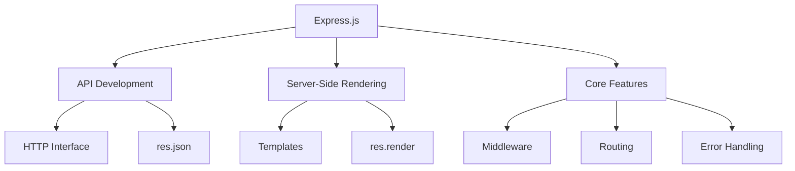
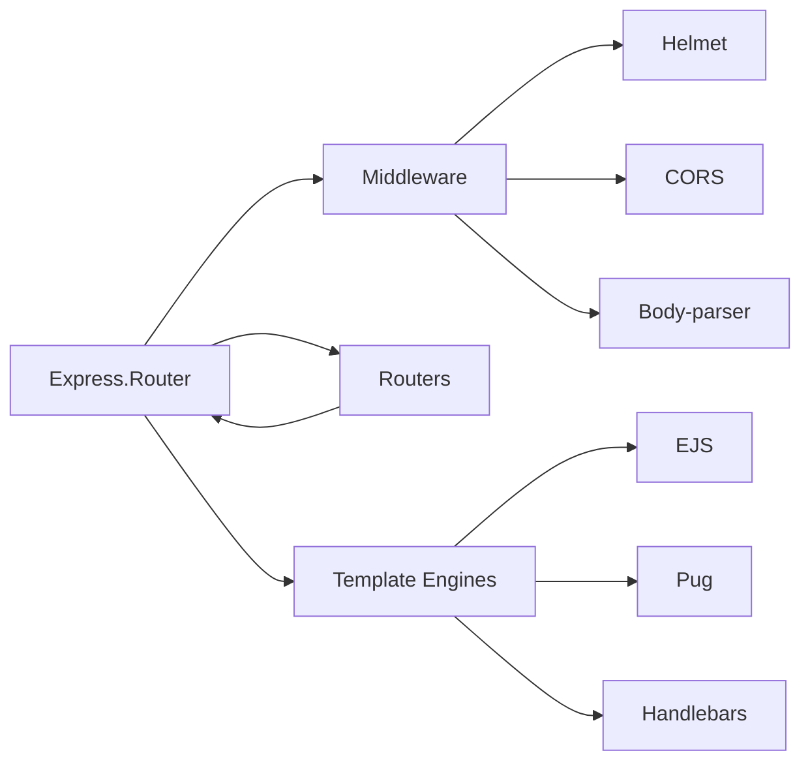

## Core Concepts
### Express vs Node.js
| **Feature**          | **Node.js**                     | **Express.js**                  |
|----------------------|---------------------------------|---------------------------------|
| **Type**             | Runtime Environment             | Web Framework                   |
| **Abstraction Level**| Low-level HTTP handling         | High-level abstractions         |
| **Development Speed**| Manual implementation           | Rapid development               |
| **Use Case**         | Building servers from scratch   | Structured web applications     |

## Primary Uses
### 1. API Development
```javascript
// API endpoint example
app.get('/api/users', (req, res) => {
  const users = [
    { id: 1, name: 'Alice' },
    { id: 2, name: 'Bob' }
  ];
  res.json(users); // Auto-converts to JSON
});
```
- **res.json()** automatically:
  - Sets `Content-Type: application/json`
  - Converts JavaScript objects to JSON
  - Handles circular references
  - Applies JSON security practices

### 2. Server-Side Rendering (SSR)
```javascript
// SSR with template engine
app.set('view engine', 'ejs');

app.get('/profile', (req, res) => {
  const user = { name: 'Alice', joined: '2023-01-15' };
  res.render('profile', { user }); // Renders views/profile.ejs
});
```
- **Template Engines**:
  - EJS, Pug, Handlebars
  - Dynamic HTML generation
  - Data binding with server data

## Setup Process
### 1. Declare Dependency (package.json)
```json
{
  "name": "weather-app",
  "version": "1.0.0",
  "description": "Retrieve current weather conditions",
  "main": "app.js",
  "dependencies": {
    "express": "^4.18.2"
  }
}
```

### 2. Install Dependencies
```bash
npm install
```
- Creates `node_modules` directory
- Installs Express + dependencies
- Generates `package-lock.json`

### 3. Basic Application Structure
```javascript
// app.js
const express = require('express');
const app = express();
const port = 3000;

// Route handler
app.get('/', (req, res) => {
  res.send('Hello Express!');
});

// Start server
app.listen(port, () => {
  console.log(`Server running at http://localhost:${port}`);
});
```

## Core Features
### Middleware System
```javascript
// Custom middleware
app.use((req, res, next) => {
  console.log(`${req.method} ${req.path}`);
  next(); // Pass control to next handler
});

// Built-in middleware
app.use(express.json()); // Parse JSON bodies
app.use(express.urlencoded({ extended: true })); // Parse form data
```

### Routing System
```javascript
// Route parameters
app.get('/users/:userId', (req, res) => {
  res.send(`User ID: ${req.params.userId}`);
});

// Route chaining
app.route('/books')
  .get((req, res) => { /* Get books */ })
  .post((req, res) => { /* Create book */ });
```

### Error Handling
```javascript
// Custom error handler
app.use((err, req, res, next) => {
  console.error(err.stack);
  res.status(500).send('Something broke!');
});

// 404 handler
app.use((req, res) => {
  res.status(404).send("Page not found");
});
```

## Production Best Practices
1. **Environment Configuration**:
   ```javascript
   const port = process.env.PORT || 3000;
   ```
2. **Security Middleware**:
   ```bash
   npm install helmet cors
   ```
   ```javascript
   app.use(require('helmet')());
   app.use(require('cors')());
   ```
3. **Template Caching** (for SSR):
   ```javascript
   app.set('view cache', process.env.NODE_ENV === 'production');
   ```
4. **Reverse Proxy Setup**:
   - Use Nginx/Apache in front of Express
   - Handle SSL termination
   - Serve static assets

## Express Ecosystem


> "Express is the de facto standard server framework for Node.js - it's minimal, unopinionated, and packed with features for web and mobile applications." - Node.js Foundation

---
description: React notes and reference about Express.js Web Application Framework.
[[Introduction to Web Frameworks]]
[[Middleware & Routers]]