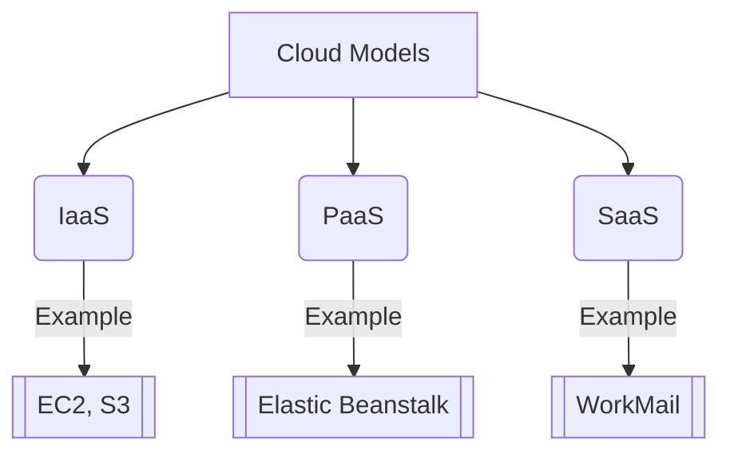
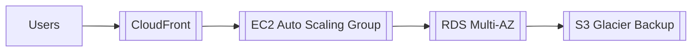

Parent: [[AWS Learning Path MOC]]  
Tags: #cloud-computing #aws #fundamentals  

---
description: React notes and reference about Cloud Computing Deep Dive.

## Definition  
Cloud computing is the **on-demand delivery** of IT resources over the Internet with **pay-as-you-go pricing**. Instead of maintaining physical data centers, users access services like:  
- Compute power ([[EC2]])  
- Storage ([[S3]])  
- Databases ([[RDS]])  
- AI/ML tools ([[SageMaker]])  

Key Characteristics:  
![[Cloud Computing Characteristics.excalidraw|300]]  
*(Visual: On-demand, Scalable, Managed Services, Global Access)*

---

## Key Benefits  
### 1. [[Cloud Agility]]  
- Rapid deployment of resources (minutes vs weeks)  
- Experimentation with new technologies (AI/ML, IoT)  
- Example: Spin up 1000 servers in 5 minutes (`[[Auto Scaling]]`)

### 2. [[Elastic Scaling]]  
- Auto-scale resources based on demand  
- Avoid over-provisioning (`[[CloudWatch Metrics]]`)  
- Use cases: Black Friday traffic spikes, batch processing

### 3. [[Cost Optimization]]  
- Convert CapEx → OpEx (no upfront hardware costs)  
- Pay-per-use models (`[[EC2 Spot Instances]]`)  
- Savings through [[AWS Cost Explorer]]

### 4. [[Global Deployment]]  
- Deploy to multiple regions via `[[AWS Global Infrastructure]]`  
- Reduce latency with `[[CloudFront CDN]]`  
- Disaster recovery with `[[Multi-AZ Deployments]]`

---

## Cloud Service Models  

### 1. [[IaaS (Infrastructure as a Service)]]  
- Managed: Virtual machines, storage, networking  
- User controls: OS, runtime, middleware  
- AWS Examples: `[[EC2]]`, `[[EBS]]`, `[[VPC]]`

### 2. [[PaaS (Platform as a Service)]]  
- Managed: Runtime environment  
- User focuses on code deployment  
- AWS Examples: `[[Elastic Beanstalk]]`, `[[Lambda]]`

### 3. [[SaaS (Software as a Service)]]  
- Fully managed applications  
- Accessed via web browsers  
- AWS Examples: `[[WorkMail]]`, `[[Chime]]`

---

## Industry Use Cases  
| Industry         | Cloud Applications                     | AWS Services Used               |
|------------------|----------------------------------------|---------------------------------|
| Healthcare       | Medical imaging analysis               | `[[S3]]`, `[[Rekognition]]`     |
| Finance          | Real-time fraud detection              | `[[Kinesis]]`, `[[Redshift]]`   |
| Gaming           | Multiplayer game backends              | `[[GameLift]]`, `[[Cognito]]`   |
| Retail           | Inventory management                   | `[[DynamoDB]]`, `[[Forecast]]`  |

---

## AWS Cloud Services Architecture  

---

## Key Concepts Linked to AWS  
1. [[Shared Responsibility Model]] - Security division between AWS/user  
2. [[Well-Architected Framework]] - AWS best practices  
3. [[Cloud Migration Strategies]] - 6Rs (Rehost, Replatform, Refactor)  
4. [[Serverless Computing]] - `[[Lambda]]`, `[[Step Functions]]`

---

## Getting Started Path  
1. Study [[AWS Cloud Practitioner Essentials]]  
2. Complete hands-on labs:  
   - [[Deploy Static Website]] (`[[S3]]`)  
   - [[Serverless API]] (`[[API Gateway]]` + `[[Lambda]]`)  
3. Take [[CLF-C02 Exam Preparation]] notes

---

> **Next Steps**: Explore [[Cloud Security Fundamentals]] or dive into specific services like `[[EC2 Deep Dive]]`

This note:  
4. Links to atomic service/concept notes (e.g., `[[EC2]]`)  
5. Uses visual diagrams (Mermaid/Excalidraw)  
6. Integrates with certification prep  
7. Shows real-world architecture patterns  
8. Connects to hands-on labs

Would you like me to create any of the linked atomic notes (e.g., [[IaaS]], [[Cloud Agility]]) in detail?