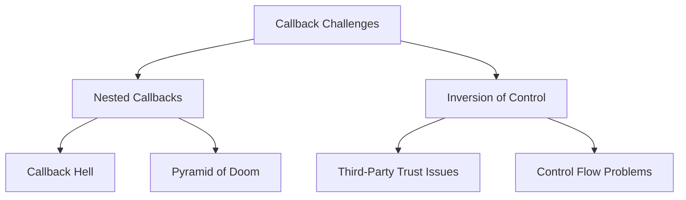
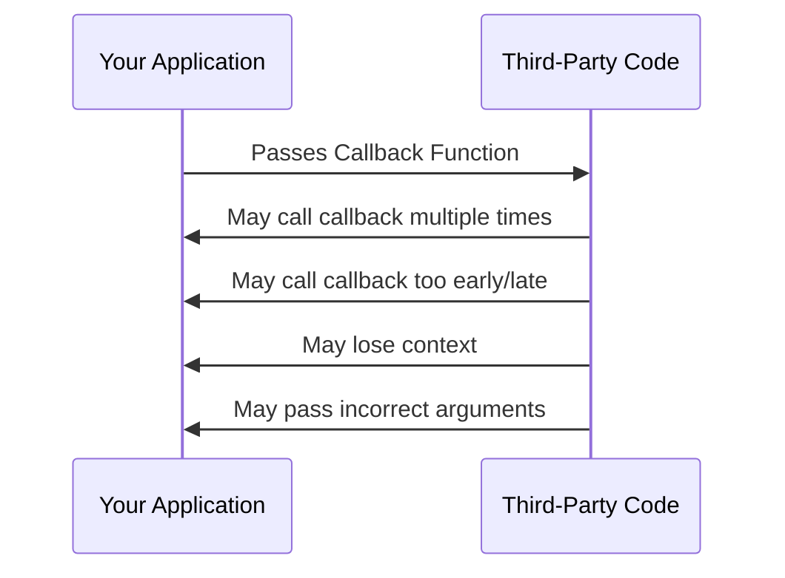

## The Sequential Execution Problem
```javascript
// Cake baking analogy in code
purchaseIngredients((ingredients) => {
  combineIngredients(ingredients, (batter) => {
    bakeCake(batter, (cake) => {
      decorateCake(cake, (decorated) => {
        serveCake(decorated);
      });
    });
  });
});
```

### Characteristics of Callback Hell:
1. **Pyramid Structure**: Deeply nested callbacks
2. **Horizontal Growth**: Code moves rightward with each callback
3. **Error Propagation**: Errors must be handled at each level
4. **Scope Sharing**: Outer scope variables become accessible in inner callbacks

## Inversion of Control (IoC) Risks


### Common IoC Failure Modes:
| **Failure Mode**       | **Consequence**                  | **Mitigation Example**             |
|------------------------|----------------------------------|------------------------------------|
| Multiple Calls         | Duplicate charges/operations     | Flag checks (`hasBeenCalled`)      |
| Never Called           | Stuck processes                  | Timeout handlers                   |
| Called Too Early       | Race conditions                  | Ready state validation             |
| Context Loss           | `this` binding errors            | Arrow functions, `.bind()`         |
| Wrong Arguments        | Runtime exceptions               | Type validation in callback        |

## Mitigation Strategies

### 1. Function Modularization
```javascript
// Instead of:
getUser(userId, (user) => {
  getOrders(user.id, (orders) => {
    // ... nested ...
  });
});

// Do:
const handleUser = (user) => getOrders(user.id, handleOrders);
const handleOrders = (orders) => { /* ... */ };

getUser(userId, handleUser);
```

### 2. Named Functions
```javascript
// Avoid anonymous pyramid:
db.query('...', (err, data) => {
  process(data, (result) => {
    // ... 
  });
});

// Use named functions:
db.query('...', handleQueryResult);

function handleQueryResult(err, data) {
  process(data, handleProcessResult);
}

function handleProcessResult(result) {
  // ...
}
```

### 3. Control Libraries
```javascript
const async = require('async');

async.waterfall([
  (callback) => purchaseIngredients(callback),
  (ingredients, callback) => combineIngredients(ingredients, callback),
  (batter, callback) => bakeCake(batter, callback),
  (cake, callback) => decorateCake(cake, callback)
], (err, decorated) => {
  if (err) handleError(err);
  serveCake(decorated);
});
```

### 4. Error Handling Patterns
```javascript
function apiCall(callback) {
  thirdPartyFunction((err, data) => {
    if (err) return callback(err);
    if (!data.valid) return callback(new Error('Invalid data'));
    callback(null, data);
  });
}

// Usage with guard clauses
apiCall((err, result) => {
  if (err) {
    console.error('API failed:', err);
    return;
  }
  // Process result
});
```

### 5. State Machines
```javascript
const state = {
  purchased: false,
  combined: false,
  baked: false
};

function nextStep() {
  if (!state.purchased) {
    purchaseIngredients(() => {
      state.purchased = true;
      nextStep();
    });
  } else if (!state.combined) {
    combineIngredients(() => {
      state.combined = true;
      nextStep();
    });
  } // ... continue
}
```

## Evolution to Better Patterns


### Comparison of Solutions:
| **Approach**       | **Nesting Solution** | **IoC Solution**       | **Complexity** |
|--------------------|----------------------|------------------------|----------------|
| Callbacks          | ❌ Poor              | ❌ Poor                | High           |
| Promises           | ✅ Chaining          | ✅ Built-in control    | Medium         |
| Async/Await        | ✅ Flat structure    | ✅ Try/catch blocks    | Low            |
| Generators         | ✅ Yields control    | ⚠️ Manual handling     | Medium         |
| ReactiveX          | ✅ Streams           | ✅ Operators           | High           |

## Key Takeaways
1. **Callback Hell** occurs when sequential operations require deep nesting
2. **Inversion of Control** creates trust issues with third-party code
3. **Mitigation Paths**:
   - Modularize functions
   - Use control flow libraries
   - Implement state machines
   - Upgrade to Promises/Async-Await
4. **Always Validate**: Check third-party callbacks for:
   - Call count
   - Argument validity
   - Timing appropriateness
5. **Evolution**: Modern JavaScript offers better alternatives (Promises, Async/Await)

> "Callback hell is the emotional state programmers reach when they've nested too many callbacks and lost track of their code's execution flow." - Anonymous JS Developer

---
description: React notes and reference about Callback Challenges Nesting & Inversion of Control.
[[Promise Patterns in JavaScript]]  
[[Async-Await Best Practices]]  
[[Reactive Programming with RxJS]]  
[[Error Handling in Asynchronous Code]]
[[Callback Functions]]