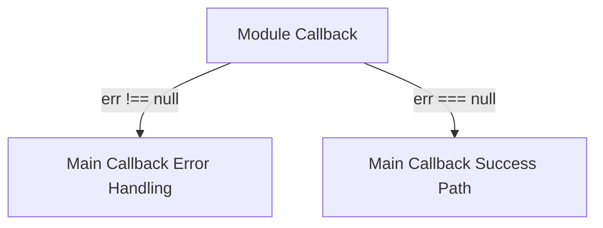

# Creating Callback Functions in Node.js


## Core Principles
1. **Error-First Convention**:
   ```javascript
   function callback(err, result) {
     if (err) {
       // Handle error
       return;
     }
     // Process result
   }
   ```
   - First parameter always reserved for error object
   - `null` indicates successful operation

2. **Layered Callback Architecture**:
   ```mermaid
   sequenceDiagram
       participant Main as Main Application
       participant Module as Node.js Module
       participant Node as Node.js Runtime
       participant Server as Remote Server
       
       Main->>Module: Calls function (with callback)
       Module->>Node: Makes http.request()
       Node-->>Module: Immediate return
       Module-->>Main: Returns control
       Server->>Node: Sends response
       Node->>Module: Triggers module callback
       Module->>Main: Invokes main app callback
   ```

## Implementation Patterns

### Basic Error Handling
```javascript
// Custom module function
exports.current = (location, resultCallback) => {
  http.request(options, (response) => {
    let data = '';
    
    response.on('data', (chunk) => {
      data += chunk;
    });
    
    response.on('end', () => {
      try {
        const parsed = JSON.parse(data);
        // Success: first param null
        resultCallback(null, parsed.current.temp_f); 
      } catch (err) {
        // Error: first param contains error
        resultCallback(err); 
      }
    });
  }).end();
};
```

### Main Application Usage
```javascript
const weather = require('./weather-module');

weather.current('KSFO', (err, temp_f) => {
  if (err) {
    console.error('Weather fetch failed:', err.message);
    res.status(500).end();
    return;
  }
  
  res.end(`Current temperature: ${temp_f}°F`);
});
```

## Key Implementation Details

### 1. Error Propagation


### 2. Resource Cleanup
Always handle resources in error scenarios:
```javascript
response.on('error', (err) => {
  cleanupConnections(); // Close DB/network connections
  resultCallback(err);
});
```

### 3. Layered Callback Flow
| **Layer**          | **Responsibility**                          | **Example**                     |
|---------------------|---------------------------------------------|---------------------------------|
| Main Application    | Business logic & final output               | Send HTTP response to client    |
| Custom Module       | Data processing & error formatting          | Parse JSON, validate data       |
| Node.js Core        | Network communication                       | Handle TCP packets, buffering   |

## Common Pitfalls & Solutions

1. **Callback Hell** (Nested callbacks):
   ```javascript
   // AVOID:
   getWeather((err, weather) => {
     getForecast(weather, (err, forecast) => {
       // More nesting...
     })
   })
   
   // SOLUTION: Modularize
   const handleWeather = (weather) => getForecast(weather);
   getWeather(handleWeather);
   ```

2. **Uncaught Exceptions**:
   ```javascript
   process.on('uncaughtException', (err) => {
     console.error('Critical failure:', err);
     process.exit(1);
   });
   ```

3. **Callback Called Multiple Times**:
   ```javascript
   let called = false; // Guard flag
   
   function callback(err, data) {
     if (called) return;
     called = true;
     // ... logic ...
   }
   ```

## Real-World Example: Weather Module
```javascript
// weather-module.js
const http = require('http');

module.exports = {
  current: (airportCode, callback) => {
    const options = {
      host: 'w1.weather.gov',
      path: `/xml/current_obs/${airportCode}.xml`
    };
    
    const req = http.request(options, (res) => {
      let data = '';
      
      res.on('data', (chunk) => data += chunk);
      
      res.on('end', () => {
        try {
          // XML parsing would actually require extra lib
          const tempMatch = data.match(/<temp_f>([^<]+)<\/temp_f>/);
          if (!tempMatch) throw new Error('Invalid response');
          
          callback(null, parseFloat(tempMatch[1]));
        } catch (err) {
          callback(err);
        }
      });
    });
    
    req.on('error', (err) => callback(err));
    req.end();
  }
};
```

> **Key Insight**: Node.js callback pattern enables non-blocking I/O by decoupling operation initiation from result handling through layered callback functions that follow strict error-first conventions.

---
[[Node.js Error Handling Patterns]]  
[[Async-Await Migration Guide]]  
[[Callback to Promise Conversion]]  
[[Express Middleware Error Handling]]
[[Callback Challenges Nesting & Inversion of Control]]