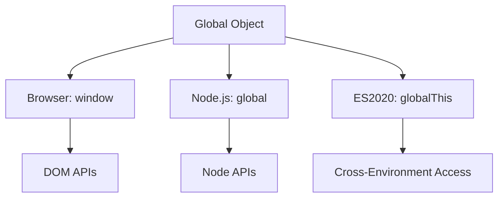

# Global Object Behavior
Parent: [[👨‍💻JavaScript Roadmap]]

Introduction:
The global object (window in browsers, global in Node.js) serves as the root scope in JavaScript applications. Understanding its behavior is essential for managing global state and avoiding naming conflicts.

Knowledge Points:
- [[Window Object]]
  - Global variables
  - Global functions
  - Built-in properties

- [[Global Scope Management]]
  - Namespace patterns
  - Module patterns
  - Global state management

#javascript #global-scope #fundamentals

### **JavaScript Global Object Behavior**

#### **1. What is the Global Object?**
- **Browser**: `window`  
- **Node.js**: `global`  
- **Universal (ES2020+)**: `globalThis`  

The global object acts as the ultimate "container" for all globally accessible variables and functions.

---
description: React notes and reference about Global object behavior.

#### **2. Key Behaviors**
| Behavior                     | Example                     | Notes                                  |
|------------------------------|-----------------------------|----------------------------------------|
| **Global Variables**         | `var x = 10;`               | `var` declarations become properties of `window` (browser) |
| **Global Functions**         | `function foo() {}`         | Added as methods to the global object  |
| **Undeclared Variables**     | `y = 20;`                   | Auto-attached to global object (avoid!)|
| **Built-in Globals**         | `console`, `Math`, `JSON`   | Pre-defined properties                 |
| **Environment Differences**  | `document` (browser-only)   | Node.js has `process`, `require`       |

---

#### **3. Critical Rules**
```javascript
// Browser
console.log(window.x === x); // true (var x = 5)

// Node.js
global.x = 5;
console.log(global.x); // 5

// Universal
console.log(globalThis === window); // true in browser
console.log(globalThis === global); // true in Node.js
```

---

#### **4. Scope Nuances**
- **`var` vs `let/const`**:
  ```javascript
  var a = 1;       // Added to window
  let b = 2;       // Not added to window
  const c = 3;     // Not added to window
  ```

- **Strict Mode**:
  ```javascript
  'use strict';
  undeclaredVar = 10; // Throws ReferenceError
  ```

---

#### **5. Memory Implications**
```javascript
// Memory leak example
function createHugeArray() {
  window.bigData = new Array(1000000); // Persists forever
}
```

---

#### **6. Best Practices**
1. **Avoid Global Variables**  
   ```javascript
   // Instead of:
   var config = {};

   // Use:
   (function() {
     const config = {}; // Module-scoped
   })();
   ```

2. **Use Modern Modules**  
   ```javascript
   // ES Module (file.mjs)
   export const safeVar = 42; // Not global
   ```

3. **Leverage Block Scoping**  
   ```javascript
   {
     const temp = "local";
     let count = 0;
   } // Auto-cleaned
   ```

---

#### **7. Node.js Specifics**
```javascript
// module1.js
var x = 5; // Not added to global
global.y = 10; // Explicit global

// module2.js
console.log(global.y); // 10
console.log(global.x); // undefined
```

---

#### **8. Why Avoid Globals?**
4. **Naming Collisions**  
   ```javascript
   // library1.js
   var cache = {...};

   // library2.js
   var cache = [...] // Overwritten!
   ```

5. **Security Issues**  
   Global variables are accessible through DevTools console.

6. **Memory Leaks**  
   Never garbage-collected.

---

### **When to Use Globals**
- Browser environment APIs (`window.location`)  
- Polyfills  
- Debugging flags  
- **Never** for application state!

---

### **Key Takeaways**
7. Use `globalThis` for environment-agnostic code  
8. Prefer modules over global variables  
9. `let/const` > `var` for scoping control  
10. Strict mode prevents accidental globals  

