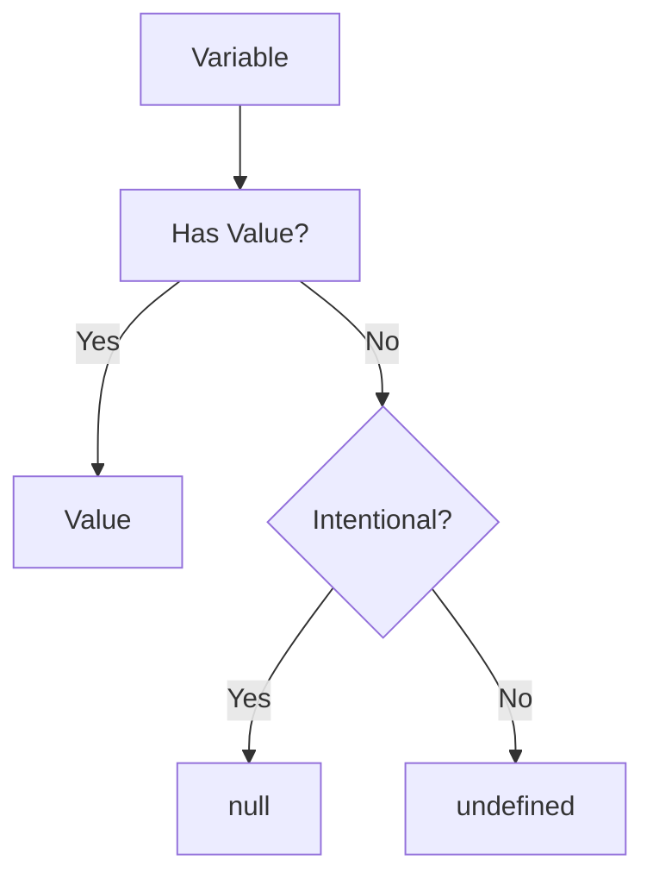

# Understanding `null` in JavaScript

## What is `null`?
`null` is a special value in JavaScript that represents the **intentional absence of any object value**. Think of it as an empty box that exists but contains nothing.

```javascript
let variable = null; // Explicitly set to "no value"
```

---
description: React notes and reference about Null.

## `null` vs `undefined`
| Feature          | `null`                          | `undefined`                     |
|------------------|---------------------------------|---------------------------------|
| **Definition**   | Intentional absence of value    | Variable declared but not assigned |
| **Type**         | `object` (historical quirk)     | `undefined`                     |
| **Use Case**     | Developer-assigned empty state  | Default empty state             |

**Code Example:**
```javascript
let emptyVar;          // undefined (default)
let explicitEmpty = null; // null (intentional)
```

---

## Real-World Use Case: User Profiles
When handling optional user data:
```javascript
let userProfile = {
  name: null,    // User hasn't provided name
  age: null,     // Age not set yet
  email: null    // Email pending
};

// Later update:
userProfile.name = "Alice";
```

---

## The `typeof` Quirk
Despite representing "no object," `null` has a surprising type check:
```javascript
console.log(typeof null); // "object" (historical JavaScript behavior)
```

---

## How to Check for `null`
Always use **strict equality**:
```javascript
if (variable === null) {
  console.log("Confirmed empty value");
}
```

---

## Conclusion
`null` is your code's way of saying:  
_"I’ve intentionally left this empty for now."_  

Think of it as a labeled empty shelf in your program’s storage room – you know exactly what’s missing and can fill it later when ready.



**Key Takeaways:**
- Use `null` for deliberate empty states
- Prefer `===` for null checks
- Remember `typeof null` quirk
- Differentiate from `undefined` in your logic