---
description: React notes and reference about Full Stack MERN & DevOps Developer Curriculum.
tags: #mern #devops #curriculum #fullstack #javascript #nodejs #react #docker #kubernetes
---

**16-week self-paced program** (1 hour/day, 7 hours/week)  
*Focus: MERN stack + DevOps → Job-ready skills*

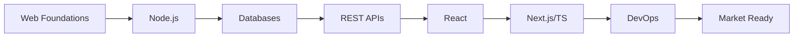

## Phase 1: Core Foundations (Weeks 1-4)
### Week 1: Web Development Foundations
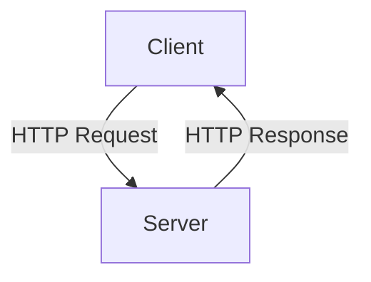

- **Focus**: HTML/CSS/JS fundamentals + Client-Server model
- **Key Concepts**:
  - `DOM` manipulation
  - HTTP request/response cycle
  - Static site deployment
- **Milestone**: Deployed static webpage
- **Resources**: 
  - [MDN Web Docs](https://developer.mozilla.org)
  - [FreeCodeCamp Responsive Web Design](https://www.freecodecamp.org/learn/responsive-web-design/)

### Week 2: Server-Side JavaScript
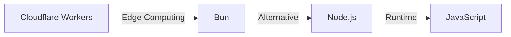

- **Focus**: Node.js fundamentals + Emerging runtimes
- **Key Projects**:
  - Simple HTTP server
  - CLI data fetcher
- **Milestone**: Node.js server running
- **Resources**:
  - [Node.js Official Docs](https://nodejs.org/en/docs)
  - [Bun Documentation](https://bun.sh/docs)

### Week 3: Databases

- **Focus**: Data modeling + ORM/ODM patterns
- **Hands-on**:
  - SQLite/PostgreSQL
  - MongoDB + Mongoose
- **Milestone**: CRUD operations via ORM
- **Resources**:
  - [MongoDB University](https://university.mongodb.com)
  - [Prisma ORM](https://www.prisma.io)

### Week 4: REST APIs
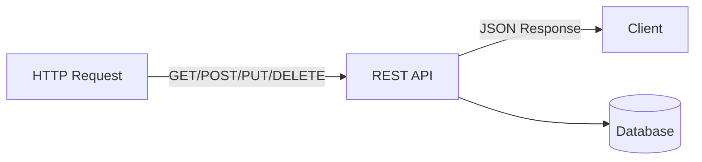

- **Focus**: Express + MongoDB integration
- **Project**: Todo API with:
  - JWT authentication
  - Error handling
  - API documentation
- **Milestone**: Functional CRUD API
- **Resources**:
  - [Express.js Framework](https://expressjs.com)
  - [Postman API Testing](https://www.postman.com)

---

## Phase 2: Full-Stack Development (Weeks 5-8)
### Week 5: React Fundamentals
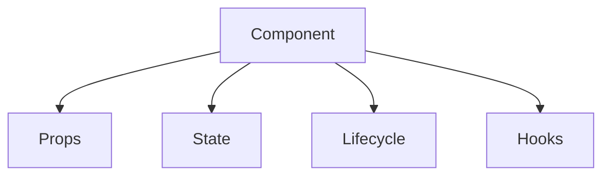

- **Focus**: Component-based UI development
- **Key Patterns**:
  - JSX syntax
  - State management
  - Component lifecycle
- **Milestone**: Deployed React app
- **Resources**:
  - [React Official Docs](https://reactjs.org/docs/getting-started.html)
  - [React Patterns](https://reactpatterns.com)

### Week 6: Next.js & TypeScript
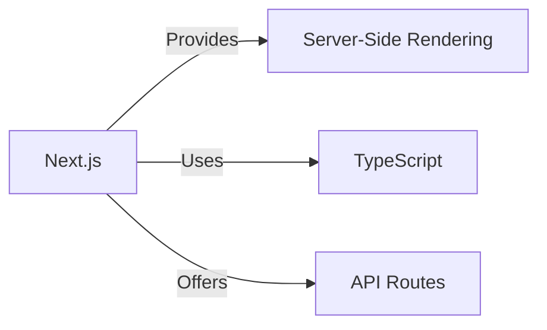

- **Focus**: Production-ready React framework
- **Upgrades**:
  - Add TypeScript types
  - Implement file-based routing
  - API route integration
- **Milestone**: Full-stack TypeScript app
- **Resources**:
  - [Next.js Documentation](https://nextjs.org/docs)
  - [TypeScript Handbook](https://www.typescriptlang.org/docs/handbook/intro.html)

### Week 7: Monorepos & Tooling
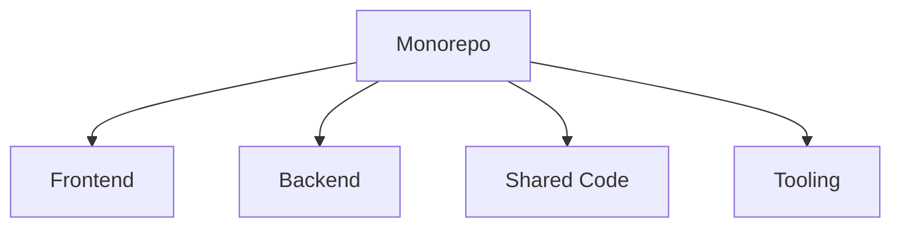

- **Focus**: Professional development workflow
- **Toolchain**:
  - Turborepo build system
  - ESLint + Prettier
  - Jest testing framework
- **Milestone**: Optimized monorepo setup
- **Resources**:
  - [Turborepo](https://turbo.build/repo)
  - [Jest Testing Framework](https://jestjs.io)

### Week 8: Real-Time Systems
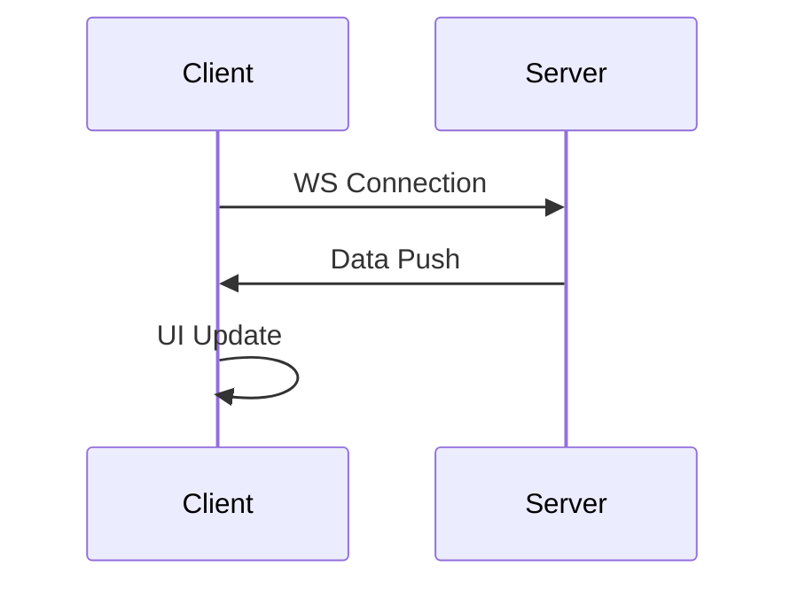

- **Focus**: WebSockets + Testing
- **Implement**:
  - Socket.IO integration
  - Unit/Integration tests
  - Cypress E2E testing
- **Milestone**: Real-time feature + Test suite
- **Resources**:
  - [Socket.IO](https://socket.io)
  - [Cypress.io](https://www.cypress.io)

---

## Phase 3: DevOps & Production (Weeks 9-14)
### Week 9: Production Backends
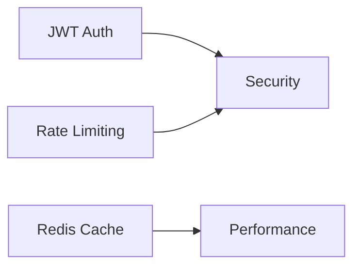

- **Focus**: Scalable + Secure services
- **Key Additions**:
  - Authentication system
  - Rate limiting
  - Redis caching
- **Milestone**: Production-grade backend
- **Resources**:
  - [OWASP Security Guide](https://cheatsheetseries.owasp.org)
  - [Redis University](https://university.redis.com)

### Week 10: Linux & Infrastructure
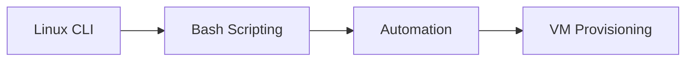

- **Focus**: Server management + Automation
- **Skills**:
  - Bash scripting
  - SSH configuration
  - Process management (PM2)
- **Milestone**: App deployed on Linux VM
- **Resources**:
  - [Linux Command Line Basics](https://ubuntu.com/tutorials/command-line-for-beginners)
  - [PM2 Process Manager](https://pm2.keymetrics.io/docs/usage/quick-start/)

### Week 11: Containerization
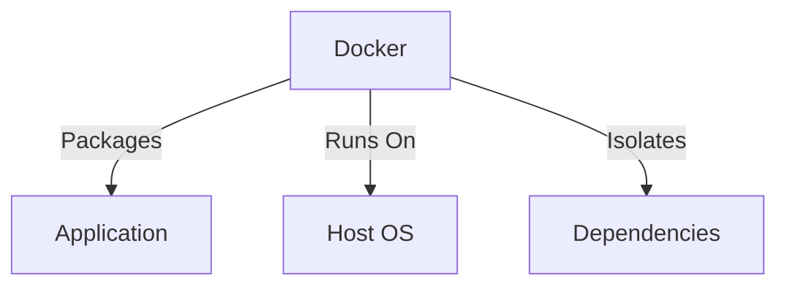

- **Focus**: Docker + Cloud deployment
- **Implementation**:
  - Dockerize MERN app
  - AWS ECS deployment
  - Container orchestration
- **Milestone**: Containerized cloud deployment
- **Resources**:
  - [Docker Documentation](https://docs.docker.com)
  - [AWS ECS Workshop](https://ecsworkshop.com)

### Week 12: Infrastructure as Code
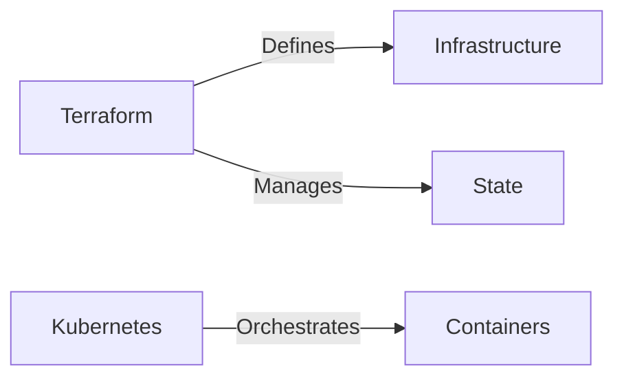

- **Focus**: Kubernetes + Terraform
- **Hands-on**:
  - Local Kubernetes cluster
  - Terraform configuration
  - Infrastructure provisioning
- **Milestone**: IaC implementation
- **Resources**:
  - [Kubernetes Basics](https://kubernetes.io/docs/tutorials/kubernetes-basics/)
  - [Terraform Learn](https://learn.hashicorp.com/terraform)

### Week 13: CI/CD Pipelines
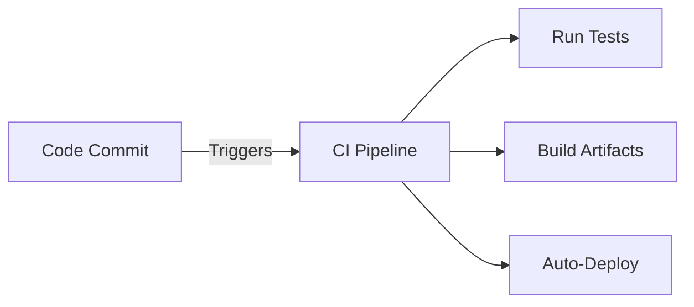

- **Focus**: Automated deployment workflows
- **Tooling**:
  - GitHub Actions
  - Automated testing
  - Deployment strategies
- **Milestone**: End-to-end CI/CD pipeline
- **Resources**:
  - [GitHub Actions Docs](https://docs.github.com/en/actions)
  - [GitOps Principles](https://www.gitops.tech)

### Week 14: Production Readiness
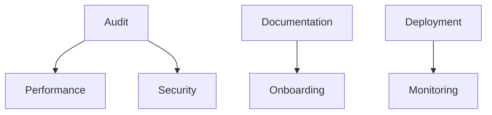

- **Focus**: Final polish + Presentation
- **Key Tasks**:
  - Performance optimization
  - HTTPS configuration
  - User feedback integration
- **Milestone**: Production-ready application
- **Resources**:
  - [Lighthouse Auditing](https://developer.chrome.com/docs/lighthouse/overview/)
  - [Let's Encrypt](https://letsencrypt.org)

---

## Learning Strategy
1. **Daily Commitment**: 1 hour focused learning
2. **Build in Public**:
   - Weekly GitHub commits
   - Progress threads on Twitter/LinkedIn
   - Technical blog posts
3. **Project Portfolio**:
   - 4 major projects
   - 8+ mini-projects
   - Public GitHub repository

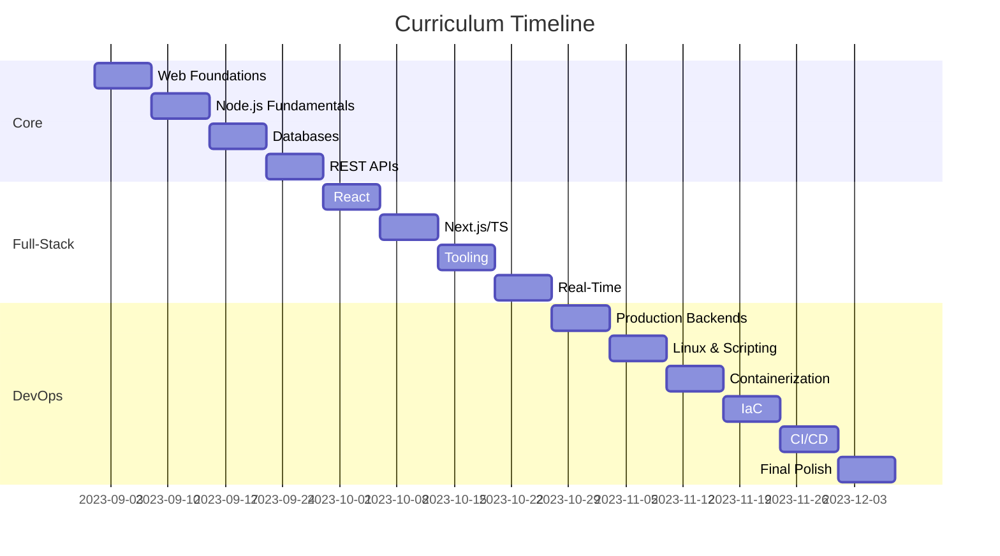

## Career Preparation
- **Portfolio Requirements**:
  - 3 full-stack deployed projects
  - CI/CD implementation samples
  - Infrastructure as Code examples
- **Job Search Materials**:
  - Technical resume highlighting MERN/DevOps
  - Project demo videos
  - Contribution history on GitHub

---

[[MERN Stack Project Ideas]]  
[[DevOps Interview Preparation]]  
[[Cloud Certification Paths]]  
[[Developer Portfolio Examples]]