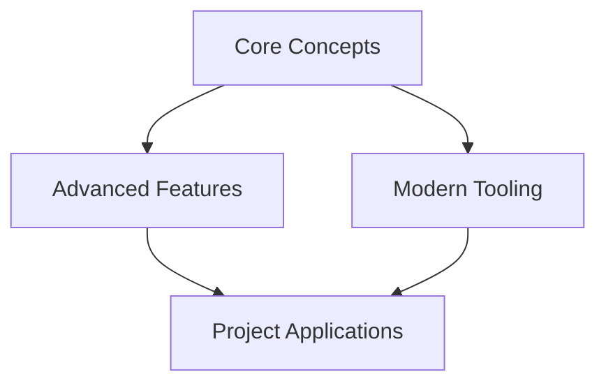

# 👨‍💻 JavaScript Roadmap

## Progress Overview
```dataviewjs
const totalItems = dv.current().file.lists.where(t => !t.checked).length
const checkedItems = dv.current().file.lists.where(t => t.checked).length
dv.span(`**Progress:** ${checkedItems}/${totalItems} (${Math.round((checkedItems/totalItems)*100)}%)`)
```

## 🌱 Core JavaScript

### Language Fundamentals
- [x] Variables and Scope #core #priority/1 ✅ 2025-02-18
  - [x] Understanding `var`, `let`, and `const` #core
  - [x] [[Block Scope vs Function Scope]]
  - [x] [[Global object behavior]] ✅ 2025-02-17
  - [x] [[Hoisting and TDZ]]

- [ ] Data Types and Structures #core #priority/1 #todo 
  - [x] [[JavaScript Types]]
    - [[Primitive Types]] 
    - Reference types
    - [[Type Coercion]]
  - [ ] [[Modern Data Structures]]
    - Map and Set
    - [[WeakMap]] and [[WeakSet]]
    - [[TypedArrays]]

- [ ] Functions and Context #core #priority/1
  - [ ] [[Function Patterns]]
    - Function declarations
    - [[Arrow functions]]
    - [[Generator functions]]
  - [ ] [[This Binding]]
    - Lexical scope
    - Call, apply, bind
    - Class context

### Advanced Concepts
- [ ] Modern Async Patterns #core #priority/1
  - [ ] [[Promises Deep Dive]]
    - Promise chaining
    - Error handling
    - Promise.all/race/any
  - [ ] [[Async/Await Patterns]]
    - Error handling
    - Parallel execution
    - Sequential vs Concurrent

- [ ] Performance Optimization #core #priority/2
  - [ ] [[Memory Management]]
    - Garbage collection
    - Memory leaks
    - Performance profiling
  - [ ] [[Runtime Optimization]]
    - Event loop
    - Microtasks
    - Task scheduling

### Modern Features
- [ ] ES2022+ Features #core #priority/2
  - [ ] [[Class Features]]
    - Private fields
    - Static blocks
    - Decorators
  - [ ] [[Modern Syntax]]
    - Optional chaining
    - Nullish coalescing
    - Top-level await

## 🔧 Development Tools

### Build and Bundle
- [ ] Modern Tooling #tooling #priority/2
  - [ ] [[Package Management]]
    - npm/yarn/pnpm
    - Workspaces
    - Monorepos
  - [ ] [[Build Tools]]
    - Vite
    - esbuild
    - SWC

### Testing and Quality
- [ ] Testing Strategy #testing #priority/1
  - [ ] [[Unit Testing]]
    - Vitest
    - Jest
    - Testing patterns
  - [ ] [[E2E Testing]]
    - Playwright
    - Cypress
    - Test coverage

## 📚 Project Applications

### Real-world Projects
- [ ] Build Applications #project #priority/1
  - [ ] [[State Management System]]
    - Observable pattern
    - Proxy-based reactivity
    - Event system
  - [ ] [[Data Fetching Library]]
    - Cache management
    - Error handling
    - Request deduplication



## 📈 Learning Progress

### Weekly Goals
```dataview
TASK FROM "JavaScript Learning"
WHERE !completed AND due < date(today) + dur(7 days)
SORT due ASC
```

### Resources
- [[JavaScript Design Patterns]]
- [[Performance Optimization Guide]]
- [[Testing Best Practices]]
- [[Modern JS Features]]

> "JavaScript: Learn the rules like a pro, so you can break them like an artist."

#javascript #roadmap #learning