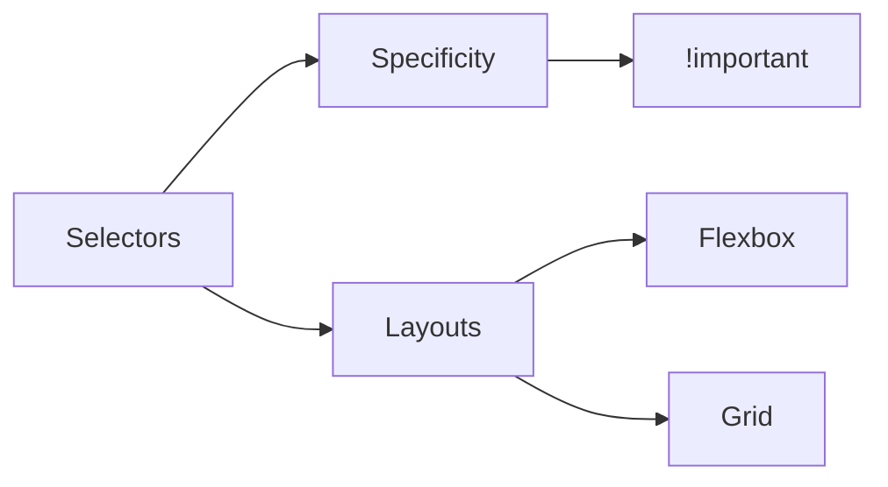
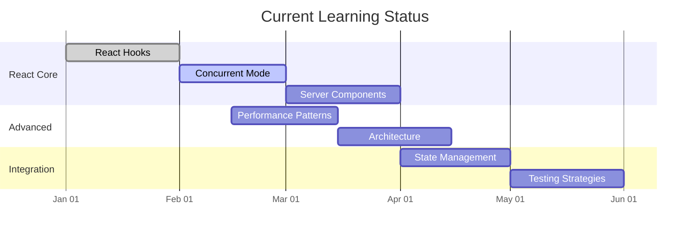
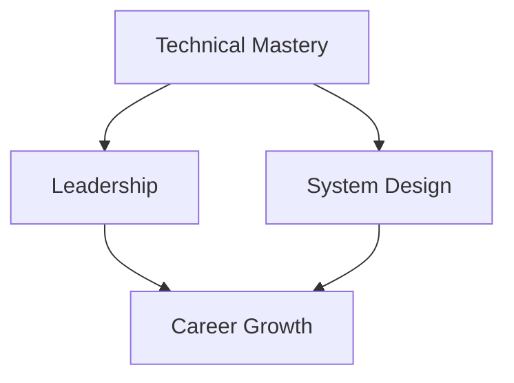

```dataviewjs
const totalItems = dv.current().file.lists.where(t => !t.checked).length
const checkedItems = dv.current().file.lists.where(t => t.checked).length
dv.span(`**Overall Progress:** ${checkedItems}/${totalItems} (${Math.round((checkedItems/totalItems)*100)}%)`)

const jsRoadmap = dv.page("👨‍💻JavaScript Roadmap")
dv.span(`[[JavaScript Roadmap|➤ Connected JavaScript Concepts]] → ${jsRoadmap.file.link}`)
```

## 🌱 Foundational Core

### 🕸️ Internet Fundamentals

- [x] [[How Does The Internet Work]]
- [x] [[HTTP Status]]
- [x] [[Domain Name]]
- [x] [[Hosting]]
- [x] [[DNS and how it works]]
- [ ] [[Browsers]]
  - Related files:
    - [[Browser Rendering Pipeline]]
    - [[Browser Memory Management]]
    - [[Browser Engine Architecture]]
    - [[Browser Security Model]]

### 📜 HTML5 Expertise

- [x] [[Accessibility]] (WCAG 2.2) ✅ 2025-02-16
- [x] Semantic SEO patterns ✅ 2025-02-16
- [ ] Microdata/RDFa implementation
- [x] [[Forms and Validations]] #current

### 🎨 CSS Mastery

- [ ] Cascade layers
- [ ] Container queries
- [x] [[CSS Houdini]] basics ✅ 2025-02-18



### ⚡ JavaScript Deep Dive

```dataview
TASK FROM "👨‍💻JavaScript Roadmap"
WHERE !completed AND contains(tags, "core")
SORT priority ASC
```

## 🚄 Mid-Level Progression

### 🛠️ Technical Specialization

```dataviewjs
// Calculate progress for each section
const pages = dv.pages('"🚀 Frontend Engineering Mastery Roadmap"')

// Helper function to count completed tasks in a section
function calculateProgress(tasks) {
    if (!tasks || tasks.length === 0) return 0
    const completed = tasks.filter(t => t.completed).length
    return Math.round((completed / tasks.length) * 100)
}

// Get all tasks and group by section
const reactCoreTasks = pages.file.tasks
    .filter(t => t.text.includes("#section/core"))
const advancedTasks = pages.file.tasks
    .filter(t => t.text.includes("#section/advanced"))
const integrationTasks = pages.file.tasks
    .filter(t => t.text.includes("#section/integration"))

// Calculate progress for each section
const reactProgress = calculateProgress(reactCoreTasks)
const advancedProgress = calculateProgress(advancedTasks)
const integrationProgress = calculateProgress(integrationTasks)

// Create progress visualization
dv.header(3, "Framework Learning Progress")
dv.paragraph(`React Core: ${reactProgress}% complete`)
dv.paragraph(`Advanced Topics: ${advancedProgress}% complete`)
dv.paragraph(`Integration: ${integrationProgress}% complete`)
```

### React Core

- [ ] React Hooks #framework/react #section/core
  - [x] useState/useEffect #section/core 🔼 ✅ 2025-02-17
  - [ ] [[Custom Hooks]] #section/core
  - [ ] Performance Hooks #section/core
  - [ ] Advanced Patterns #section/core
- [ ] Concurrent Mode #framework/react #section/core
  - [ ] [[Suspense]]
    - Related files:
      - [[Suspense Fundamentals]]
      - [[Data Fetching with Suspense]]
      - [[Code Splitting with Suspense]]
      - [[Suspense Best Practices]]
  - [ ] [[Transitions]]
  - [ ] [[Streaming SSR]]
  - [x] [[Data fetching]]
- [ ] Server Components #framework/react #section/core
  - [ ] Component types
  - [ ] Data flow
  - [ ] [[Hydration]]
  - [ ] Optimization

### Advanced

- [ ] Performance Patterns #framework/react #section/advanced
  - [ ] [[Code splitting]]
    - Related files:
      - [[Code splitting]]
      - [[Route-Based Splitting]]
      - [[Component-Level Splitting]]
      - [[Advanced Splitting Patterns]]
  - [ ] [[Bundle optimization]]
    - Related files:
      - [[Bundle Analysis]]
      - [[Tree Shaking]]
      - [[Asset Optimization]]
      - [[Build Tool Configuration]]
  - [ ] [[Performance Patterns]]
    - Related files:
      - [[Rendering Optimization]]
      - [[State Management Performance]]
      - [[Network Performance]]
      - [[Resource Loading]]
  - [ ] Memory management
- [ ] Architecture #framework/react #section/advanced
  - [ ] Component design
  - [ ] State modeling
  - [ ] Side effects
  - [ ] Testing strategy

### Tasks

- [x] Learn React [[Suspense]] #todo
  - Section: React Core
  - Due: 2024-03-15
  - Estimated hours: 3
  - Location: 🚀 Frontend Engineering Mastery Roadmap

### Integration

- [ ] State Management #framework/react #section/integration
  - [ ] Redux/toolkit
  - [ ] Context patterns
  - [ ] Query caching
  - [ ] State machines
- [ ] Testing Strategies #framework/react #section/integration
  - [ ] Unit testing
  - [ ] Integration tests
  - [ ] E2E testing
  - [ ] Performance testing



## Related Notes

- [[React Best Practices]]
- [[Performance Optimization]]
- [[Testing Strategies]]

## Progress Queries

```dataview
TASK FROM "Framework Learning"
WHERE !completed
GROUP BY section
```


### 📦 Build Optimization

- [ ] Webpack Module Federation
- [ ] Vite/Rollup tree-shaking
- [ ] Differential bundling

### 🔍 Testing Strategy

```dataview
TABLE coverage, type FROM #testing
WHERE status != "complete"
SORT coverage DESC
```

## 🏗️ Senior-Level Architecture

### 🧩 System Design Patterns

```dataview
TABLE difficulty, focus FROM "System Design"
WHERE category = "frontend" AND status != "complete"
SORT difficulty DESC
```

### 🚀 Performance Leadership

```progress
width: 85%
label: Core Web Vitals
percent: 45
```

- [ ] LCP optimization
- [ ] CLS reduction
- [ ] INP improvements

## 🎯 FAANG Interview Prep

### 💻 Technical Challenges

```dataview
LIST FROM #interview/coding
WHERE contains(topics, "javascript") AND difficulty >= "mid"
LIMIT 5
```

### 🧠 Behavioral Framework

```dataview
TASK FROM #behavioral
WHERE !completed
GROUP BY category
```

### 🔗 Resource Network

```dataview
TABLE rating, focus, url FROM #resource
WHERE contains(company, "FAANG") OR author = "ex-FAANG"
SORT rating DESC
```

## 🛠️ Project Portfolio

### 🧩 Mid-Level Projects

```dataview
TABLE difficulty, tags, status FROM "Projects"
WHERE difficulty = "mid" AND !completed
SORT priority DESC
```

### 🌟 Senior Showcases

```dataview
TABLE impact, complexity FROM "Projects"
WHERE difficulty = "senior" AND status = "complete"
SORT impact DESC
```


### 📈 Progress Analytics

```dataview
TASK FROM "🚀 Frontend Engineering Mastery Roadmap"
WHERE !completed
GROUP BY file.link
```

### 🔄 Retrospective Template

```markdown
## Weekly Retrospective ({{date:YYYY-MM-DD}})

**Accomplishments:**

- **Blockers:**

- **Next Steps:**

-
```

---
description: React notes and reference about 🚀 Frontend Engineering Mastery Roadmap.

### 🔗 Knowledge Network

- [[Frontend Architecture]]
- [[Browser Internals]]
- [[Web Performance Patterns]]
- [[JavaScript Runtime Deep Dive]]

> "The expert in anything was once a beginner." - Helen Hayes
>
> ```query
> path:"🚀 Frontend Engineering Mastery Roadmap"
> ```

## 🎯 Senior Engineer Path

### 💻 Technical Mastery

- [ ] Advanced React Patterns

  - Related files:
    - [[React Advanced Hooks]]
    - [[Component Design Patterns]]
    - [[Performance Optimization Techniques]]
    - [[State Management Architecture]]

- [ ] Full-Stack Integration

  - Related files:
    - [[Next.js Architecture]]
    - [[API Integration Patterns]]
    - [[Backend Communication]]
    - [[GraphQL Implementation]]

- [ ] Infrastructure & Tooling
  - Related files:
    - [[Build System Optimization]]
    - [[CI/CD Pipeline Design]]
    - [[Testing Strategy]]
    - [[Monitoring and Logging]]

### 👥 Leadership & Collaboration

- [ ] Technical Leadership

  - Related files:
    - [[Code Review Guidelines]]
    - [[Mentoring Strategies]]
    - [[Technical Documentation]]
    - [[Architecture Decision Records]]

- [ ] Project Management
  - Related files:
    - [[Agile Development]]
    - [[Sprint Planning]]
    - [[Risk Management]]
    - [[Stakeholder Communication]]

### 🏗️ System Design

- [ ] Frontend Architecture
  - Related files:
    - [[Micro-Frontend Architecture]]
    - [[Scalable Component Systems]]
    - [[State Management Patterns]]
    - [[Performance Optimization]]

### 📈 Career Growth

- [ ] Professional Development
  - Related files:
    - [[Technical Leadership Path]]
    - [[Architecture Specialization]]
    - [[Industry Trends]]
    - [[Continuous Learning]]


