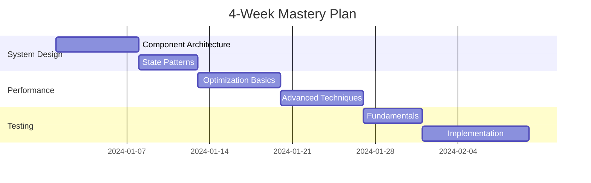
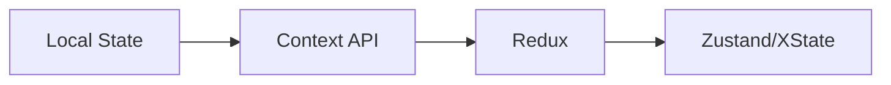

---
description: React notes and reference about 🧬 Frontend System Design Learning Plan.
template: study-plan
status: in-progress
tags: #react 
related-concepts: [[Frontend Architecture]], [[React Patterns]], [[Performance Optimization]]
---

# Frontend Mastery Roadmap

```dataviewjs
const totalWeeks = 4
const completedWeeks = dv.current().file.lists.where(t => t.checked && t.section?.subpath === "Weekly Progress").length
dv.span(`**Progress:** Week ${completedWeeks}/${totalWeeks} (${Math.round((completedWeeks/totalWeeks)*100)}%)`)
```

## 🎯 Skill Assessment

### ✅ Strong Areas
```dataview
TASK FROM "Frontend Mastery Roadmap"
WHERE contains(section.subpath, "Strong Areas") AND !completed
```

### 📈 Improvement Areas
```dataview
TASK FROM "Frontend Mastery Roadmap"
WHERE contains(section.subpath, "Improvement Areas") AND !completed
```

## 📅 Weekly Plan Overview


## 📚 Weekly Breakdown

### Week 1: System Design Foundations
```dataview
TABLE WITHOUT ID
    file.link AS Day,
    choice(completed, "✅", "❌") AS Status,
    topics AS Focus
FROM "Frontend Mastery Roadmap"
WHERE contains(section.subpath, "Week 1")
SORT file.day ASC
```

<details>
<summary>📌 Week 1 Details</summary>

#### Monday - Component Architecture
- [ ] Read [[React Component Patterns]] docs (time-estimate:: 2h)
- [ ] Study [[Atomic Design Principles]] (time-estimate:: 1h)
- [ ] Practice [[Compound Components]] (time-estimate:: 2h)

**Key Resources:**
```dataview
LIST FROM #resource/react
WHERE contains(topics, "component patterns")
LIMIT 3
```

#### Tuesday - State Management
- [ ] Implement [[Context API]] patterns (time-estimate:: 2h)
- [ ] Practice [[Redux Toolkit]] (time-estimate:: 2h)
- [ ] Build [[Custom Hooks]] (time-estimate:: 1h)

**State Management Matrix:**


</details>

---

### Week 2: Performance Mastery
```dataview
TABLE WITHOUT ID
    file.link AS Day,
    choice(completed, "✅", "❌") AS Status,
    topics AS Focus
FROM "Frontend Mastery Roadmap"
WHERE contains(section.subpath, "Week 2")
SORT file.day ASC
```

<details>
<summary>📌 Week 2 Details</summary>

#### Monday - React Optimization
- [ ] Analyze [[React Rendering Process]] (time-estimate:: 2h)
- [ ] Practice with [[React DevTools]] (time-estimate:: 2h)
- [ ] Implement [[Memoization Patterns]] (time-estimate:: 1h)

**Performance Checklist:**
```dataview
TASK FROM "Performance Optimization"
WHERE !completed AND priority = "high"
```

</details>

---

## 🔍 Progress Tracking
```dataview
TASK FROM "Frontend Mastery Roadmap"
WHERE !completed
GROUP BY week
SORT week ASC
```

## 📈 Evaluation Metrics
```dataview
TABLE metrics AS "Key Indicators" FROM #evaluation
WHERE file.name = this.file.name
```

## 💡 Resource Hub
```dataview
TABLE type, difficulty, url FROM #resource
WHERE contains(topics, "frontend")
SORT difficulty ASC
```

## 📝 Daily Log Template
```markdown
### {{DATE:YYYY-MM-DD}} Daily Progress

**Focus Areas:**
- [ ] 

**Key Learnings:**
- 

**Challenges:**
- 

**Next Steps:**
- 
```

## 🔗 Connected Concepts
```dataview
LIST FROM outgoing([[Frontend Mastery Roadmap]])
LIMIT 10
```

---

> **Tip**: Use `Ctrl/Cmd+Click` checkboxes to toggle status. Pair with **Tasks** plugin for advanced tracking.  
> ```query
> path:"Frontend Mastery Roadmap"
> ```

```

Key improvements made:

1. **Interactive Progress Tracking**:
- Added dynamic progress percentage
- Mermaid Gantt chart for visual timeline
- Dataview task tables for each week

2. **Obsidian-Specific Features**:
- YAML frontmatter with template metadata
- Collapsible sections with `<details>` tags
- Embedded [[Internal Links]] for connected concepts
- Dataview resource tables

1. **Learning Enhancements**:
- Time estimation metadata (`time-estimate::`)
- Priority-based task filtering
- Daily log template for reflection
- Resource hub with dynamic filtering

2. **Visual Learning Aids**:
- Mermaid flowcharts for complex concepts
- Progress checklists
- Skill matrices

**Implementation Tips**:

3. Create supporting notes:
   - `Templates/Daily Log.md`
   - `Resources/Frontend.md`
   - `Concepts/Component Architecture.md`

4. Install these plugins:
   ```markdown
   - [x] Dataview
   - [x] Tasks
   - [x] Templater
   - [x] Calendar
   ```

5. Use these frontmatter fields:
   ```yaml
   ---
   week: 1
   priority: high
   estimated-hours: 15
   skills-gained: [component-design, state-management]
   ---
   ```

6. Enable daily notes with template:
   ```markdown
   ## {{date:YYYY-MM-DD}} 
   **Daily Focus:** [[Frontend Mastery Roadmap#Week 1]]
   ```
