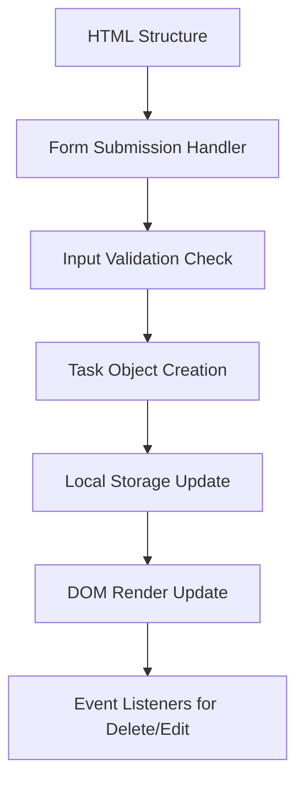

#project 
Here's a structured plan to approach building your Task Manager while reinforcing JavaScript concepts from your roadmap:

### **Phase 1: Project Setup**
1. **Define Core Features**
   - Task creation/display
   - Local storage persistence
   - Task deletion
   - Form validation
   - UI state management

2. **Technical Requirements Mapping**
   | Feature           | JS Concepts Involved          | Roadmap Connection          |
   |-------------------|-------------------------------|-----------------------------|
   | Local Storage     | `localStorage` API            | Browser Storage             |
   | [[DOM Manipulation]]  | Element creation/updates      | DOM Methods                 |
   | Event Handling    | Form submission, click events | Event Listeners             |
   | Form Validation   | Input validation patterns     | Form Handling               |

### **Phase 2: Core Implementation Flow**

### **Phase 3: Development Strategy**
1. **Atomic Implementation Order**
   - Basic DOM structure (no JS)
   - Form submission handler
   - Temporary array storage
   - Local storage integration
   - Delete functionality
   - Form validation
   - UI polish

2. **Key Challenge Points**
   - Maintaining sync between DOM and storage
   - Proper event delegation for dynamic elements
   - Validation feedback UX
   - Data serialization/deserialization

3. **Testing Checklist**
   - Data persists after refresh
   - Multiple task management
   - Empty input prevention
   - Cross-browser storage behavior
   - Mobile responsiveness

### **Phase 4: Progressive Enhancement**
4. **Version 1 (MVP)**
   - Basic CRUD operations
   - Simple validation
   - Local storage

5. **Version 2 (Advanced)**
   - Edit existing tasks
   - Task categories/filters
   - Due dates
   - Search functionality

6. **Version 3 (Polish)**
   - Animations
   - Undo/redo
   - Export/import
   - Dark mode

### **Learning Opportunities**
7. **Key Concepts to Reinforce**
   - Array methods (`filter`, `map`)
   - JSON serialization
   - Event propagation
   - Error boundaries
   - IIFE pattern for private state

8. **Common Pitfalls to Avoid**
   - Direct [[DOM Manipulation]] without state
   - Storage race conditions
   - Event listener memory leaks
   - Insecure innerHTML usage
   - Blocking main thread

### **Phase 5: Project Retrospective**
9. **Post-Completion Analysis**
   - Compare with initial roadmap goals
   - Identify skill gaps revealed
   - Document architectural decisions
   - Measure performance metrics

10. **Next Steps**
   - Add to portfolio
   - Write project post-mortem
   - Contribute to OSS task managers
   - Explore alternative implementations