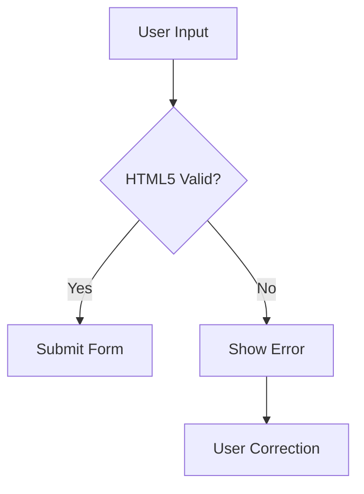

## Definition
> Form validation is the process of ensuring user input meets specific criteria before submission, implemented through HTML attributes and/or JavaScript checks.

## Key Points
- **Client-side vs Server-side**: 
  - Client-side (instant feedback) 
  - Server-side (security essential)
- **HTML5 Validation**:
  - Built-in input constraints
  - Attributes: `required`, `pattern`, `min`, `max`
- **JavaScript Validation**:
  - Custom validation logic
  - Constraint Validation API
- **[[Accessibility]]**:
  - ARIA roles for error messages
  - Clear visual error indicators
- **Validation Types**:
  - Format validation (emails, numbers)
  - Range validation
  - Required fields
  - Custom pattern matching

## How Validation Works
### 1. HTML5 Validation
```html
<input type="email" required pattern=".+@example\.com">
```

### 2. JavaScript Validation
```javascript
const form = document.querySelector('form');
form.addEventListener('submit', (e) => {
  if (!validateEmail()) {
    e.preventDefault();
    showError();
  }
});
```

### 3. Constraint Validation API
```javascript
const emailInput = document.getElementById('email');

if (emailInput.validity.typeMismatch) {
  emailInput.setCustomValidity('Please use @example.com domain');
}
```

## Best Practices
1. Use HTML5 validation as first layer
2. Always implement server-side validation
3. Provide clear error messages
4. Validate on blur and submit events
5. Use ARIA live regions for screen readers
6. Style invalid fields with CSS pseudo-classes:
```css
input:invalid { border-color: red; }
```

## Common Pitfalls
```html
<!-- Bad: No error message connection -->
<input id="name" required>
<div class="error"></div>

<!-- Good: ARIA association -->
<input aria-describedby="name-error">
<div id="name-error" role="alert"></div>
```

## Validation Comparison Table
| Method          | Pros                      | Cons                     |
|-----------------|---------------------------|--------------------------|
| HTML5           | Quick implementation      | Limited customization    |
| JavaScript      | Full control              | More complex to maintain |
| Server-side     | Security critical         | No instant feedback      |

## Visual Diagrams

### 1. Validation Process Flow


### 2. Validation Layers
```
┌───────────────────┐
│  Server-Side      │ ← Security Critical
├───────────────────┤
│  JavaScript       │ ← Complex Rules
├───────────────────┤
│  HTML5            │ ← Basic Constraints
└───────────────────┘
```

## Personal Notes Section

### My Validation Strategy
- **First Layer**: HTML5 constraints
- **Second Layer**: Real-time JavaScript checks
- **Final Check**: Server-side validation
- **Error Handling**:
  - Clear message positioning
  - Accessible aria-live regions
  - Color + icon + text feedback

### Common Mistakes to Avoid
1. Relying solely on client-side validation
2. Generic error messages ("Invalid input")
3. Poor error message visibility
4. Not validating on multiple events

## Practice Area
```html
<form id="demoForm">
  <input type="email" id="email" required>
  <div id="emailError" role="alert"></div>
  <button type="submit">Submit</button>
</form>

<script>
// Add validation logic here
</script>
```

## Summary
- HTML5 provides basic validation attributes
- JavaScript enables complex validation scenarios
- Constraint Validation API bridges HTML/JS validation
- Accessible error messaging is crucial
- Server-side validation remains essential

## Resources
-  [ArticleMDN Web Docs: Client-side form validation](https://developer.mozilla.org/en-US/docs/Learn/Forms/Form_validation)
- [ArticleLearn Forms by web.dev](https://web.dev/learn/forms/)
- [ArticleW3Schools: JavaScript Form Validation](https://www.w3schools.com/js/js_validation.asp)


> "Good validation is like a helpful assistant, not a strict gatekeeper."
> ```query
> path:"Form Validation"
> ``` 
****