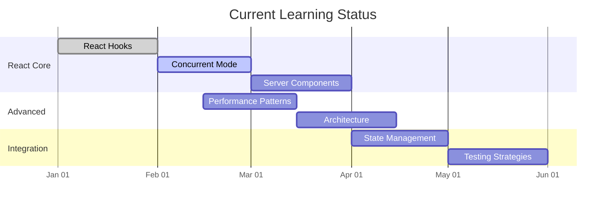

### React Core
- [ ] React Hooks #framework/react #section/core
  - [x] useState/[[useEffect]]
  - [x] Custom Hooks
  - [ ] Performance Hooks
  - [ ] [[useRef]] #current 
  - [ ] UseContext #current 
  - [ ] Advanced Patterns
- [ ] Concurrent Mode #framework/react #section/core
  - [ ] [[Suspense]] #rating/1 #core 
  - [ ] [[Transitions]] #rating/1 #core 
  - [ ] [[Streaming SSR]] #rating/1 #core 
  - [ ] [[Data fetching]] #rating/1 #core 
- [ ] Server Components #framework/react #section/core
  - [ ] Component types
  - [ ] Data flow
  - [ ] Hydration
  - [ ] Optimization

### Advanced
- [ ] Performance Patterns #framework/react #section/advanced
  - [ ] [[Code splitting]] #react #rating/1 #core 
  - [ ] [[Bundle optimization]] 
  - [ ] [[Bundle optimization]] 
  - [ ] Rendering patterns
  - [ ] Memory management
- [ ] Architecture #framework/react #section/advanced
  - [ ] Component design
  - [ ] State modeling
  - [ ] Side effects
  - [ ] Testing strategy

### Integration
- [ ] State Management #framework/react #section/integration
  - [ ] Redux/toolkit
  - [ ] Context patterns
  - [ ] Query caching
  - [ ] State machines
- [ ] Testing Strategies #framework/react #section/integration
  - [ ] Unit testing
  - [ ] Integration tests
  - [ ] E2E testing
  - [ ] Performance testing



## Related Notes
- [[React Best Practices]]
- [[Performance Optimization]]
- [[Testing Strategies]]

## Progress Queries
```dataview
TASK FROM "Framework Learning"
WHERE !completed
GROUP BY section
```

## Timeline Updates
Last updated: 2025-02-08
Next review: 2025-02-15