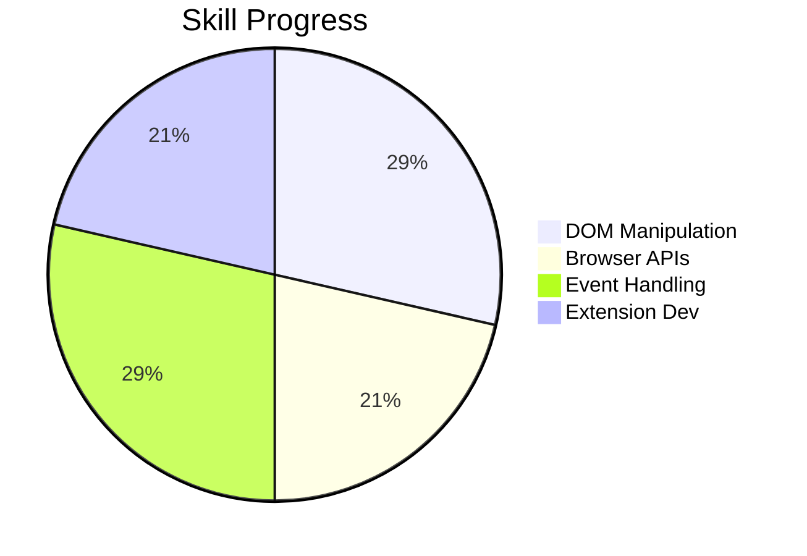

### 🚀 Core Concepts Mastered
1. **Local Storage Integration**
   - Data persistence using `localStorage`
   ```js
   const leadsFromLocalStorage = JSON.parse(localStorage.getItem("myLeads"));
   if (leadsFromLocalStorage) {
     myLeads = leadsFromLocalStorage;
     renderLeads();
   }
   ```

2. **DOM Event Handling**
   - `dblclick` event implementation
   ```js
   deleteBtn.addEventListener('dblclick', () => {
     localStorage.clear();
     myLeads = [];
     ulEl.innerHTML = '';
   });
   ```

3. **Function Parameters & [[Template literals]]**
   - Dynamic content rendering
   ```js
   function renderLead(lead) {
     const listItem = document.createElement("li");
     listItem.innerHTML = `<a href="${lead}" target="_blank">${lead}</a>`;
     ulEl.append(listItem);
   }
   ```

4. **Chrome Extension Development**
   - Chrome API usage
   ```js
   chrome.tabs.query({active: true, currentWindow: true}, (tabs) => {
     myLeads.push(tabs[0].url);
     localStorage.setItem("myLeads", JSON.stringify(myLeads));
     renderLeads();
   });
   ```

### 🛠️ Project Summary
**Chrome URL Saver Extension**  
- ✅ Persists data using localStorage  
- ✅ Implements CRUD operations  
- ✅ Uses Chrome tabs API  
- 🚧 Future: CSV export feature  

### 📈 Key Progress Metrics
- [[DOM Manipulation]]: 4/5  
- Browser APIs: 3/5  
- Event handling: 4/5  
- Extension development: 3/5  

