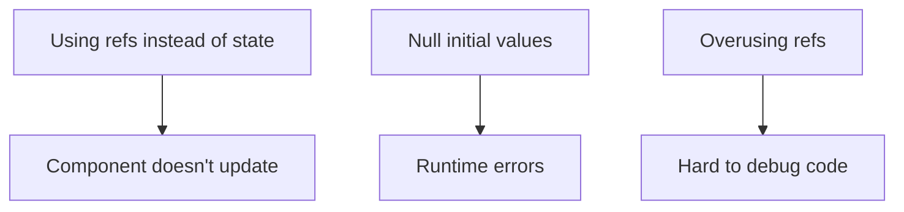

description: useRef creates a mutable ref object that persists across renders without triggering re-renders, useful for direct DOM access and storing previous values.
alias: [React useRef Hook]
tags: [react, hooks, reference]tags: ["UseState", "hooks"]

---

# useRef Hook

## Key Takeaways
- Creates mutable object with `.current` property
- Persists values between renders without re-renders
- Direct DOM access when needed
- Stores previous values or mutable variables

## Basic Usage
```jsx
import { useRef } from 'react';

function MyComponent() {
  const inputRef = useRef(null);

  const handleClick = () => {
    inputRef.current.focus();
  };

  return (
    <>
      <input ref={inputRef} />
      <button onClick={handleClick}>Focus Input</button>
    </>
  );
}
```

## Key Features
1. **DOM Access**
   ```jsx
   const divRef = useRef();
   // <div ref={divRef}>Measure me</div>
   // divRef.current.getBoundingClientRect()
   ```

2. **Value Persistence**
   ```jsx
   const renderCount = useRef(0);
   useEffect(() => {
     renderCount.current += 1;
   });
   ```

3. **Mutable Values**
   ```jsx
   const timerRef = useRef();
   useEffect(() => {
     timerRef.current = setInterval(...);
     return () => clearInterval(timerRef.current);
   }, []);
   ```

## Common Use Cases
- Accessing DOM elements
- Storing previous state values
- Keeping mutable variables
- Integrating third-party DOM libraries
- Managing focus/scroll position

## Common Mistakes


## Advanced Patterns
### Previous Value Tracking
```jsx
function usePrevious(value) {
  const ref = useRef();
  useEffect(() => {
    ref.current = value;
  });
  return ref.current;
}
```

### Imperative Handle
```jsx
const FancyInput = forwardRef((props, ref) => {
  const inputRef = useRef();
  useImperativeHandle(ref, () => ({
    focus: () => inputRef.current.focus()
  }));
  return <input ref={inputRef} ... />;
});
```

## Related Content
```dataview
LIST FROM #hooks   OR #UseState 
WHERE contains(file.name, "use") 
  OR contains(file.tags, "state-management")
SORT file.ctime DESC
LIMIT 5
```

### Key Comparisons
| Feature          | useRef                 | useState               |
|------------------|------------------------|------------------------|
| Re-renders       | ❌ No                  | ✅ Yes                 |
| Async Updates    | ✅ Immediate          | ❌ Batched            |
| Storage Type     | Mutable object         | Immutable state        |
| Use Case         | DOM access, variables  | UI-driven values       |

### TypeScript Tip
```typescript
const inputRef = useRef<HTMLInputElement>(null);
// Access with optional chaining:
inputRef.current?.focus();
```

## When Not to Use
- State that should trigger UI updates
- Prop values that need reactivity
- Data flow between components
- Form state management

> **Pro Tip:** Combine with `useEffect` for side effect management and DOM measurements after render.
```query
path:"React Hooks"
```