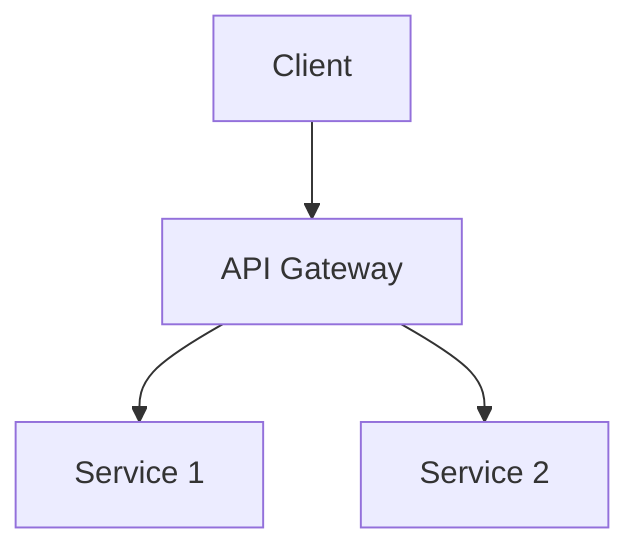

# {{title}} System Design

## 🎯 Problem Statement
- Target Scale: X users
- Core Features: 
- Performance Requirements:
- Technical Constraints:

## 🏗️ High-Level Design

## 🔍 Component Breakdown
### Frontend Architecture
- Component Tree
- State Management
- Data Flow
- Event Handling

### Technical Implementation
- Key Libraries/Tools
- APIs/Protocols
- Data Structures
- Algorithms

## ⚡ Performance Considerations
- Caching Strategy
- Loading Patterns
- Optimization Techniques
- Memory Management

## 🛡️ Edge Cases & Error Handling
- Error Scenarios
- Recovery Strategies
- Fallback Mechanisms
- User Experience

## 📈 Scaling Considerations
- Performance Bottlenecks
- Scaling Strategies
- Monitoring Plan
- Future Improvements

## 🔗 Related Resources
- Reference Materials:
- Similar Implementations:
- Technical Documentation:

---
linked: [[System Design]]
tags: #system-design #case-study